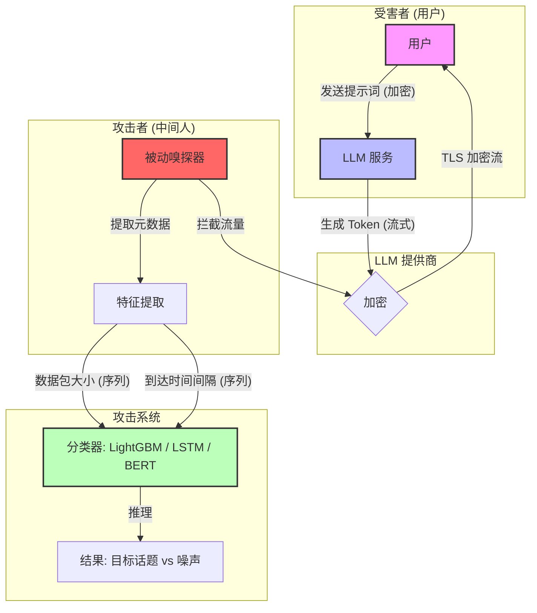

# WHISPER LEAK: A SIDE-CHANNEL ATTACK ON LARGE LANGUAGE MODELS
 
 ---

**作者**：
* **Geoff McDonald** (Microsoft, Vancouver, Canada) 
    * *背景*：微软首席研究经理 (Principal Research Manager)，深耕恶意软件检测与机器学习安全领域，拥有丰富的反病毒与威胁情报研究经验。
* **Jonathan Bar Or (JBO)** (Microsoft, Redmond, USA) 
    * *背景*：微软首席安全研究员 (Principal Security Researcher)，著名的跨平台漏洞挖掘专家与黑客，曾多次发现 macOS、Linux 及固件层面的关键漏洞，是微软 Defender 跨平台研究架构的核心人物。

**年份**：2025年11月

**摘要**：
本文提出了一种名为 "Whisper Leak" 的新型侧信道攻击技术，揭示了即便在使用 TLS 加密的情况下 ，攻击者仍能通过分析流式传输的数据包大小与时序模式，以极高的精度（在 28 个主流商用大模型上超过 98% AUPRC）推断出用户与大模型对话的具体敏感主题。

---

## 一、这篇论文讲了一个什么样的故事？
### **学术故事：加密幻觉与流式侧信道的博弈**

本论文通过一个严谨的逻辑链条，揭示了现代 LLM 架构中 **用户体验与隐私安全** 之间的深层矛盾，其学术故事可解构为以下四个乐章：

### 1. 幻觉 (The Illusion)：加密黑盒的虚假安全感（故事背景）
学术界与工业界的传统假设认为，基于 **TLS/HTTPS** 的传输层加密构建了一个不可通过的“黑盒”。在这一假设下，用户与 LLM 的敏感交互（如医疗咨询、法律合规询问）被认为对中间人（ISP、网络窃听者）是完全不透明的。

### 2. 冲突 (The Conflict)：流式传输的代价（存在的问题）
为了追求极致的用户体验（低延迟首字生成），现代 LLM 普遍采用 **自回归流式传输 (Autoregressive Streaming)**。这一架构决策迫使系统必须以 Token 为单位即时发送数据包。这种一个个字接龙输出的方式，打破了加密的“黑盒子”。因为每个字蹦出来时，都会产生一个特定的数据包。虽然数据包的内容是加密的，但 **数据包的大小（Size）和接龙的节奏（Time）** 保留了下来 。

### 3. 高潮：节奏即指纹 (Rhythm as Fingerprint)（解决办法）
论文的核心发现在于 **“语义-流量同构性”**。特定的敏感语义主题（如“洗钱合法性”）会引发模型特定的生成长度分布与停顿节奏。
攻击者无需解密内容，仅通过被动嗅探加密流量的 **元数据（Metadata）**——即数据包大小序列（Size Sequence）与到达时间间隔（Inter-arrival Times）——即可提取出高辨识度的 **“侧信道指纹”**。

攻击者虽然看不懂加密后的乱码，但他只需要像听摩斯密码一样，记录下这些 **数据包的大小序列和时间间隔**。通过训练一个机器学习模型，他就能惊人地发现：“哦，这个节奏模式，99% 的概率是在聊洗钱！”

### 4. 启示 (The Implication)：透明的保险箱（结论）
这一研究揭示了 AI 系统面临的系统性漏洞：**内容加密并不等同于意图保密**。在流式传输场景下，TLS 仅保护了文本符号，却未能掩盖语义生成的行为模式。对于高精度的机器学习攻击者而言，这种加密通信就如同隔着磨砂玻璃的哑剧——尽管看不清字迹，但意图已一览无余。

在 AI 时代，保护内容（Content）已经不够了，如果不掩盖 AI 思考和生成的“行为模式”（Pattern），隐私依然荡然无存 。

---

## 二、本文的核心思想和创新点

### **1.核心思想**
本文的核心思想很简单：不同的语义主题（例如“询问洗钱教程”与“询问天气”）会导致 LLM 产生截然不同的**生成节奏**和**长度分布**。攻击者只需通过被动监听网络流量，就能通过机器学习模型识别出这些模式，从而推断出用户正在谈论敏感话题。

### **2.创新点**

本文的技术传新点在基于前人的基础上做了以下创新：

- 1.不纠结于还原具体文本，而将其变成一个 **“主题分类”** 的任务；
- 2.本文的实验很充分，对市面上主流的28个大模型都进行了测试，结果证明这并非某个特定厂商的实现 Bug，而是 **流式架构（Streaming Architecture）与自回归生成（Autoregressive Generation）** 结合后的必然系统性漏洞。

---

## 三、方法是怎么实现的？(How does it work?)

### 1.架构

论文的核心攻击架构展示了攻击者如何作为被动网络窃听者（Passive Network Adversary），在不解密 TLS 流量的情况下推断对话主题。

*(注：这是一个基于论文 Figure 1 逻辑重构的 Mermaid 流程图，展示了从用户交互到攻击者推断的全过程。)*

### 2.关键算法
该攻击方法的实现主要分为3个阶段：**数据捕获->特征工程->模型推理**

**Step 1: 数据捕获 (Data Capture)** ：攻击者使用工具（如 tcpdump）捕获用户与 LLM 服务器之间的 TLS/HTTPS 流量。

**Step 2: 特征提取 (Feature Extraction)序列化**: 
- 提取两个核心序列：1.大小序列 (Sizes)；2.时序序列 (Times)。也就是模型的生成节奏和停顿。
- 预处理：
    - LightGBM/LSTM: 对序列进行零填充（Zero-padding）或截断，使其达到固定长度（例如目标 LLM 的 95 分位长度）。
    - BERT: 将连续的数值（大小和时间）离散化（Binning）为 Token（如 [TIME_5], [LEN_12]），以便利用 Transformer 进行处理 。
    
**Step 3: 分类器训练与推理 (Classification)训练**: 使用二分类器（Binary Classifier）区分“目标话题”（如洗钱）与“背景噪声”（如日常闲聊）。将流量元数据视为一种“语言”进行理解。

### 3. 关键公式

该方法的理论基础建立在 TLS 加密对数据长度的保留特性上。

**1. TLS 长度泄露公式**

这是攻击成立的物理基础。虽然 TLS 加密了内容，但密文长度与明文长度呈线性关系：
$$size(ciphertext) = size(plaintext) + C$$

- 其中$C$是由加密协议（如 MAC、Padding、Header）引入的常数开销 。这意味着明文 Token 的长度变化直接映射为密文数据包的大小变化。

**2. 特征向量构建**

对于 LightGBM 模型，输入特征 $X$ 是大小序列 $S$ 和时间序列 $T$ 的拼接与扁平化：
$$X = [s_1, s_2, ..., s_L, t_1, t_2, ..., t_L]$$
- 其中 $L$ 是固定的序列长度（Pad/Truncate length）。

**3. 数据包注入防御公式 (Mitigation Context)**

为了防御此类攻击，论文在第 6.3 节提出了基于统计分布的数据包注入算法。虽然这是防御部分，但理解它有助于理解攻击主要针对的是“真实分布”。注入间隔采样自正态分布：
$$\text{Interval} \sim \mathcal{N}(\mu_{dataset}/k, \sigma)$$
注入包的大小采样（如果是单调递增序列）：
$$size_{new} = size_{last} + \mathcal{N}(\mu_{increase}, \sigma_{increase})$$
这说明攻击之所以有效，是因为真实的 LLM 流量并不遵循这种人工噪声分布，而是具有特定的语义相关的统计特征。

---

## 4. 实验效果 (Experimental Results)

### 4.1 实验设置 (Experimental Setup)

为了验证攻击的普适性和有效性，作者设计了一个大规模的跨模型实验环境：

**受害者模型 (Victim Models)**：测试了 **28 个**来自主要供应商（OpenAI, Microsoft, Google, Anthropic, Mistral, Meta, DeepSeek, Alibaba 等）的主流商用 LLM 。
- **数据集构建**：
    - **目标集 (Target)**：针对敏感话题“洗钱合法性”生成的 100 个语义相似但措辞不同的问句变体（例如："Is it illegal to engage in money laundering?"）。
    - **噪声集 (Noise)**：从 Quora Question Pairs 数据集中随机抽取的 11,716 个无关问题，作为背景流量 。
- **总查询量**：每个模型收集多达 21,716 次查询的加密流量记录 。

**攻击模型架构**：训练了三种不同类型的二分类器来区分目标话题和噪声：
- **LightGBM**（基于特征向量）。
- **Bi-LSTM**（基于原始序列）。
- **BERT-based**（基于离散化 Token 序列的 Transfer Learning）。

**评估指标**：主要使用 **AUPRC** (Area Under the Precision-Recall Curve)，该指标特别适合评估数据极度不平衡的场景 。
### 4.2 主要结果 (Main Results)
实验结果揭示了该漏洞在行业内的普遍性和严重性：

**极高的攻击成功率**：在测试的 28 个模型中，有 **17 个模型** 的 AUPRC 超过了 **98%**，部分模型甚至接近完美分类（>99.9%）。

**高危模型**：`mistral-large`, `gpt-4o-mini`, `deepseek-r1`, `grok-3-mini` 等模型表现出极高的脆弱性 。

**相对抵抗模型**：Google Gemini 系列（AUPRC ~81.9-84.0%）和 Amazon Nova 系列表现出相对较低的脆弱性，这可能与其内部更激进的 Token Batching（批处理）机制有关 。

**特征重要性**：仅使用“数据包大小”特征通常就能获得极佳的效果，而“时序特征”在某些模型（如 `microsoft-gpt-4.1-nano`）上提供了互补的信号 。

 **极端不平衡下的精准度（模拟真实监控）**：为了模拟真实世界中敏感对话极少发生的情况，作者设定了 **10,000:1** 的噪声对目标比例 。

**惊人的 100% 精确度**：在此设置下，28 个模型中有 **17 个** 允许攻击者在 **5-20% 的召回率（Recall）** 下达到 **100% 的精确度（Precision）** 。

**含义**：这意味着攻击者可以在每 10,000 个无关对话中，精准地揪出 1 个真正的敏感对话，且**完全没有误报 (False Positives)** 。

### 4.3 消融实验 (Ablation Studies)

作者进行了两项关键的消融研究，以探究数据量和模型参数对攻击效果的影响：

1.**数据量影响 (Data Volume)** 

**设置**：针对 `gpt-4o` 模型，将数据集扩展到 12 万条样本，噪声比例提升至 9.4:1 。

**结论**：攻击效果（AUPRC）随着训练数据的增加而**显著提升** 。
 
**模型差异**：BERT 架构的模型从大数据量中获益最大，表现优于 LightGBM 和 LSTM，这表明如果是拥有海量数据的攻击者（如 ISP），威胁将比实验结果更大 。

2.**温度参数影响 (Temperature)** 

**设置**：调整 LLM 的 Temperature 参数（从 0.0 到 1.0），控制输出的随机性 。

**结论**：虽然直觉上更高的随机性可能破坏流量模式，但实验显示 Temperature 的变化对攻击成功率**没有统计学上的显著影响** 。即使在高 Temperature 下，攻击依然有效。

---

基于论文 **"WHISPER LEAK: A SIDE-CHANNEL ATTACK ON LARGE LANGUAGE MODELS"**，以下是关于其优点与缺点、深度思考以及关键术语的详细解构。

### 5. 优点与缺点 (Pros & Cons)

#### 优点 (Strengths)

* **工业级规模的验证 (Comprehensive Scale)**：不同于许多仅在单个模型上进行概念验证（PoC）的研究，本文测试了 **28 个** 主流商用 LLM（涵盖 OpenAI, Google, Microsoft, Anthropic 等），证明了这是整个行业普遍存在的系统性漏洞 。

* **极其现实的威胁建模 (Realistic Threat Modeling)**：论文没有停留在实验室环境（50:50 正负样本比例），而是模拟了 **10,000:1** 的极端不平衡场景（即每 10,000 个日常对话中才有一个敏感对话）。在如此苛刻的条件下，攻击依然能达到 **100% 精确度**（无误报），这极大地增强了该攻击在真实监控场景下的可信度和威胁度 。

* **攻击范式的实用化升维 (Practical Shift in Paradigm)**：作者放弃了难度极高且不稳定的“文本重构”（猜出你在说什么词），转而攻克“主题推断”（猜出你在聊什么事）。这种高层语义分类在监控、审查等实际攻击场景中更具破坏力，且技术实现门槛更低（仅需 LightGBM）。

* **防御机制的量化评估 (Quantified Mitigation Analysis)**：论文不仅提出了攻击，还详细评估了三种防御策略（随机填充、批处理、注入）的“安全-性能”权衡（Trade-off），为业界修复漏洞提供了直接的数据支持 。

#### 缺点 (Limitations)

* **目标话题单一 (Single Target Scope)**：实验主要聚焦于单一敏感话题（“洗钱合法性”）。虽然这是一个很好的代表性案例，但没有证明该方法是否能有效区分语义非常接近的两个话题（例如区分“询问化学作业”和“询问制造炸弹”），这可能会影响泛化性的评估。

* **交互模式受限 (Limited Interaction Mode)**：实验仅限于**单轮查询（Single-turn query）** 。现实中的对话往往是多轮的，虽然作者推测多轮对话会泄露更多信息，但缺乏实证数据来量化多轮上下文对攻击精度的具体影响。

* **防御逃逸的探索不足 (Limited Adaptive Attack)**：虽然测试了防御手段，但作者并未深入探讨“自适应攻击”（Adaptive Attack）。例如，如果攻击者知道对方使用了 Packet Injection，是否可以通过更复杂的深度学习模型（如 Transformer）来过滤掉这些人工噪音？这一点留为了未来工作。

---

### 6. 思考与启发 (Reflections & Insights)

* **“透明保险箱”悖论 (The Paradox of the Transparent Safe)**：我们习惯认为端到端加密（TLS）是隐私的终极防线。但这篇论文展示了一个残酷的现实：**加密保护了内容，但暴露了行为。** 当行为模式（流量节奏）与思维内容（语义）高度绑定时，加密通道就变成了一个透明的保险箱——我们可以看见里面的东西在动，从而猜出它是什么 。

* **架构层面的“不可能三角” (Architectural Trade-off)**：该漏洞并非代码 Bug，而是现代 LLM 三大核心特性撞击的产物：**自回归生成**（一个接一个生）+ **流式传输**（为了快）+ **变长编码**（为了省）。
想要彻底修复这个漏洞，厂商必须在**“用户体验（即时响应）”**、**“运营成本（带宽/计算）”**与**“隐私安全”**之间做出艰难抉择。例如，Token Batching 虽然有效，但会增加用户等待的首字延迟 。

* **审查技术的不对称进化 (Asymmetric Evolution of Censorship)**：这项技术为网络审查提供了低成本、高精度的工具。ISP 或监管机构无需破解 HTTPS，仅凭流量特征即可识别并阻断特定类型的敏感对话。这提示我们在设计隐私系统时，必须从“内容隐私”升级到“元数据隐私” 。

---

