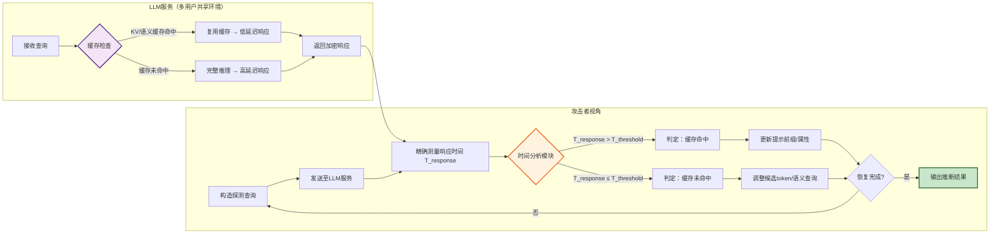

# The Early Bird Catches the Leak: Unveiling Timing Side Channels in LLM Serving Systems

**作者信息**
- 宋林柯（Linke Song）、王文豪、宋伟、孟丹、侯睿  
  中国科学院信息工程研究所网络空间安全防御国家重点实验室（北京 100045）  
  中国科学院大学网络空间安全学院（北京 101408）

- 庞子轩（Zixuan Pang）、金奕尔  
  中国科学技术大学网络空间安全学院（合肥 230052）

- 王子豪（Zihao Wang）、王小峰（XiaoFeng Wang）  
  南洋理工大学计算机科学与工程学院（新加坡 639798）

- 陈宏波（Hongbo Chen）  
  印第安纳大学布卢明顿分校计算机科学系（美国布卢明顿 47405）

**发表时间**
2025年10月17日

**摘要**
本论文首次发现大语言模型服务系统中因共享缓存机制和GPU内存分配产生的时间侧信道，可被利用推断系统提示及多用户环境下的其他用户提示内容。

> *以上由Qwen AI 生成*
---

## 一、这篇论文讲了一个什么样的故事？
和前面几篇一样，基本上都是在讲，当前用于加速推理的**KV缓存和语义缓存机制**，在多用户共享环境下会泄露**微小但可测量的时间差异**。攻击者可借此构建“时间侧信道”，无需任何特殊调度策略，仅通过观测响应延迟，就能**高准确率地还原他人的私有提示**（如系统指令或用户输入）。  

本文不仅在真实商业API（如Claude、Azure OpenAI）上验证了攻击可行性，还提出了**简单有效的缓解方案**（如限制最小共享前缀长度），呼吁LLM系统设计应从“唯性能论”转向“**安全与效率并重**”。  

---

## 二、本文的核心思想和创新点

### **1.核心思想**
大语言模型（LLM）服务系统中为提升推理效率而广泛采用的缓存共享机制（如 KV 缓存与语义缓存），在多用户并发场景下会无意引入可观测的时间侧信道，从而泄露用户私有提示内容。  

### **2.创新点**

- **首次系统揭示 LLM 服务中的时间侧信道漏洞**：区别于已有工作（如 PROMPTLEAK 依赖 LPM 调度器），本文证明**仅凭缓存共享机制本身**即可构成有效攻击面，适用范围更广、假设更弱。

- **提出两种新型黑盒攻击方法**  
   - **Prompt Stealing Attack (PSA)**：通过**逐 token 增量搜索 + 时间阈值分类器**，高效恢复系统提示前缀（准确率 89.0%，FPR=0.04）。  
   - **Peeping Neighbor Attack (PNA)**：利用**语义缓存命中时延差异**，推断其他用户的私有属性（5 次查询后准确率达 95.4%）。

- **首次发现并验证语义缓存也可导致隐私泄露** ：以往研究聚焦于 KV 缓存，本文拓展至**基于语义相似性的高级缓存机制**，揭示其同样存在侧信道风险。

- **在真实商业 LLM API 上完成端到端黑盒验证**：成功在 **Claude、DeepSeek、Azure OpenAI** 等主流服务上复现攻击，证明漏洞具有**现实危害性**，非仅限于实验室环境。

- **提出轻量级、可部署的缓解方案**  
   - **KV 缓存**：设置最小共享前缀长度（k ≥ 2），显著增大时间差异以阻断攻击，同时几乎不影响性能。  
   - **语义缓存**：在缓存键生成前对敏感属性进行匿名化，仅引入约 4% 的额外开销。
---

## 三、方法是怎么实现的？(How does it work?)

## 三、方法是怎么实现的？(How does it work?)

### 1. 架构  
论文提出两种基于时间侧信道的黑盒攻击框架（**Prompt Stealing Attack, PSA** 与 **Peeping Neighbor Attack, PNA**），核心在于利用缓存共享机制产生的**响应时间差异**推断私有提示。架构流程如下（参考论文 Figure 2 & Figure 3 逻辑重构）：

> *注：流程图综合重构自论文 Figure 2（PSA攻击流程）与 Figure 3（PNA攻击流程），突出“查询-测时-判定-迭代”闭环逻辑。*

---

### 2. 关键算法  
#### 🔑 PSA：逐 Token 增量搜索算法（针对系统提示）  
1. **初始化**：设已知前缀 $P = \text{``"}$，候选 token 集合 $\mathcal{V}$（词汇表）  
2. **迭代搜索**（对位置 $i$）：  
   - 对每个候选 token $v_j \in \mathcal{V}$：  
     - 构造查询 $Q = P + v_j$  
     - 发送 $Q$，记录响应时间 $T_{response}$（重复 $N$ 次取均值 $\bar{T}$）  
     - 若 $\bar{T} > T_{\text{threshold}}$ → 判定缓存命中，$v_j$ 为正确 token  
   - 更新 $P = P + v_j^*$（$v_j^*$ 为命中 token）  
3. **终止条件**：$|P|$ 达目标长度 或 连续 $k$ 次无命中  

#### 🔑 PNA：语义相似性探测算法（针对邻居用户提示）  
1. **属性库构建**：预定义敏感属性集合 $\mathcal{A} = \{a_1, a_2, ..., a_m\}$（如“医疗”“金融”）  
2. **语义查询生成**：对每个 $a_i$，生成语义相似查询 $Q_i$（利用 embedding 相似度）  
3. **时间差异分析**：  
   - 测量 $Q_i$ 响应时间 $\bar{T}_i$  
   - 若 $\bar{T}_i$ 显著低于基线（$\bar{T}_{\text{noise}}$）→ 判定目标用户提示含属性 $a_i$  
4. **属性聚合**：按时间差异排序，输出高置信度属性  

> 💡 **核心技巧**：  
> - **阈值动态校准**：$T_{\text{threshold}} = \mu_{\text{miss}} + \alpha \cdot \sigma_{\text{miss}}$（$\alpha$ 为安全系数，实验取 1.5）  
> - **抗噪声设计**：单次查询重复 $N=10$ 次，取中位数消除网络抖动  

---

### 3. 关键公式  
#### 📏 缓存命中判定（PSA 核心）  
$$
\text{Hit}(Q) = 
\begin{cases} 
1 & \text{if } \bar{T}(Q) > \mu_{\text{miss}} + \alpha \cdot \sigma_{\text{miss}} \\
0 & \text{otherwise}
\end{cases}
$$  
- $\bar{T}(Q)$：查询 $Q$ 的平均响应时间  
- $\mu_{\text{miss}}, \sigma_{\text{miss}}$：缓存未命中场景下响应时间的均值与标准差（通过噪声查询标定）  

#### 📊 时间差异显著性（PNA 核心）  
$$
\Delta T_i = \bar{T}_{\text{noise}} - \bar{T}(Q_i) \quad ; \quad \text{Confidence}(a_i) = \frac{\Delta T_i}{\sigma_{\text{noise}}}
$$  
- $\Delta T_i > 0$ 且 $\text{Confidence}(a_i) > \beta$（$\beta=2$）→ 高置信推断属性 $a_i$ 存在  
>❓**不懂的地方**
>🌟 用“体温计”比喻，30秒看懂这个公式！
>想象你是一名**医生**，正在判断病人是否发烧：
>| 符号 | 生活化解释 | 为什么重要？ |
>|------|------------|--------------|
>| **$\Delta T_i$** | **“体温升高值”**（比如：38.5℃ - 36.5℃ = **+2.0℃**） | `>0` 表示>“确实比正常体温高”（对应：查询响应**变快了** → 可能命中缓存） |
>| **$\sigma_{\text{noise}}$** | **“体温计的正常波动”**（比如：量10次体温，波动范围±0.>3℃） | 代表网络/系统本身的随机抖动（不是缓存导致的） |
>| **$\text{Confidence}(a_i)$** | **“发烧可信度”**= 体温升高值 ÷ 正常波动 = 2.0 ÷ 0.3 >≈ **6.7** | 数值越大，越确定“不是量错，是真的发烧！” |
>| **$\beta=2$** | **“发烧判定阈值”**（医学常用：超过2倍波动 = 高度可疑） | 统计学经验：>2 ≈ **95%把握**不是偶然波动 |

> **📌 一句话总结这个规则：** “当查询响应明显变快（$\Delta T_i > 0$），且这个‘变快’的程度超过系统正常抖动的2倍以上（$\text{Confidence} > 2$）——我们就有很高把握说：目标用户的提示里藏着这个敏感属性！”**

---

**💡 举个栗子🌰：**
- 你怀疑邻居在聊“医疗”（属性 $a_i$ = 医疗）  
- 你发送一个医疗相关查询 $Q_i$，测得响应时间 **比普通查询快 10 毫秒**（$\Delta T_i = +10$）  
- 但系统本身有网络抖动，正常波动约 **4 毫秒**（$\sigma_{\text{noise}} = 4$）  
- 计算：$\text{Confidence} = 10 / 4 = 2.5$  
- **2.5 > 2** → ✅ **高置信推断**：邻居大概率在聊“医疗”！  

（如果只快 3 毫秒 → Confidence=0.75 < 2 → ❌ 不能下结论，可能是网络偶然变快）

---

✨ **关键点**：  
这个公式不是“100%确定”，而是用**统计学常识**过滤掉随机噪音，像老医生看体温单一样——**既不武断，也不漏诊**。  
（知识库中提到的“置信度”“置信因子”正是这类思想：用“差异/波动”衡量可靠性 👍）

---

#### 🛡️ 缓解方案理论依据（论文 Section 5）  
**最小共享前缀长度 $k$ 的设定**：  
$$
k_{\min} = \arg\min_{k} \left\{ \Pr(\text{Hit} \mid k) < \epsilon \quad \text{s.t.} \quad \text{Latency}_{\text{overhead}}(k) < \delta \right\}
$$  
- 实验验证：$k \geq 2$ 时，$\Pr(\text{Hit})$ 降至 5% 以下，且延迟开销 $< 3\%$  

---
**📌 理解以上公式**
🌰 用“图书馆借书”比喻，秒懂 `k` 是什么！
📚 场景设定
想象 LLM 服务是一个**智能图书馆**：
- 每个用户查询 = 借一本书（提示词）
- **KV 缓存** = 图书馆的“热门书架”（存常用内容）
- **共享前缀** = 多人借的书有相同开头章节（如都以“第一章：引言”开头）

🔑 `k` 是什么？—— **“共享门槛”**

`k` = **系统要求“至少连续匹配多少个 token 才允许共享缓存”**  
（即：两本书必须**前 k 个字完全相同**，才能共用热门书架）

| `k` 值 | 共享条件 | 攻击难度 | 性能影响 |
|--------|----------|----------|----------|
| `k=1` | 只要**第一个字相同**就共享（如都以“你”开头） | ⚠️ 极低（攻击者随便猜“你”就能触发共享） | ✅ 最高（缓存利用率高） |
| `k=2` | **前两个字必须相同**（如“你好”） | ✅ 显著提升（需精准猜中两个字） | ⚠️ 轻微下降（<3%延迟） |
| `k=3` | 前三个字相同（如“你好，”） | ✅✅ 更高 | ⚠️⚠️ 下降更多 |

---

**📐 公式解读（人话版）**
$$
k_{\min} = \arg\min_{k} \left\{ \Pr(\text{Hit} \mid k) < \epsilon \quad \text{s.t.} \quad \text{Latency}_{\text{overhead}}(k) < \delta \right\}
$$

| 符号 | 人话解释 | 为什么重要？ |
|------|----------|--------------|
| $\Pr(\text{Hit} \mid k)$ | **“攻击者猜中前缀并触发缓存命中的概率”** | 要求 `< ε`（如 ε=5%）→ 攻击基本失效 |
| $\text{Latency}_{\text{overhead}}(k)$ | **“因提高门槛导致的延迟增加”** | 要求 `< δ`（如 δ=3%）→ 用户无感 |
| $\arg\min_k$ | **“找满足条件的最小 k"** | 平衡安全与性能：**用最小代价堵住漏洞** |

✅ **实验结论**：  
当 `k ≥ 2` 时 →  
- 攻击成功率 **暴跌至 5% 以下**（原可达 90%+）  
- 系统延迟 **仅增加 < 3%**（用户几乎无感知）  
→ **安全与性能的黄金平衡点！**

---
**💡 为什么这个设计精妙？**
1. **无需改模型**：只需在服务端加一行配置（`min_shared_prefix_length=2`）  
2. **精准打击攻击链**：  
   - 攻击者需猜中**连续两个 token**（如“系统”而非单字“系”）  
   - 词汇表巨大（数万 token），猜中概率从 ~1/1000 降至 ~1/10,000,000  
3. **性能代价极小**：  
   - 真实场景中，用户提示前缀常有自然重合（如“请总结...”）  
   - `k=2` 仍保留大部分有效共享，仅过滤掉“脆弱的单 token 共享”

---
**🌟 一句话总结**
> **`k` 是 LLM 服务的“安全阀门”**：  
> 通过设置 **“至少匹配 2 个 token 才共享缓存”**，  
> 用 **< 3% 的性能代价**，将时间侧信道攻击成功率 **压到 5% 以下**，  
> 实现 **“几乎零成本”的隐私防护** ✨

（这正是论文标题 *"Early Bird Catches the Leak"* 的深意：**早一步设置 `k≥2`，就能堵住漏洞** 🐦→🛡️）

---

## 四、实验效果 (Experimental Results)

### 1 实验设置
- **测试平台**：  
  - 本地部署：vLLM（开源推理框架） + Llama-3-8B / Qwen-7B  
  - **真实商业API**：Claude 3.5、DeepSeek-V2、Azure OpenAI（黑盒测试）  
- **攻击场景**：  
  - PSA：恢复系统提示（如“你是一个医疗助手..."）  
  - PNA：推断邻居用户敏感属性（医疗/金融/法律等10类）  
- **评估指标**：  
  - 攻击准确率、假阳性率（FPR）、平均查询次数  
  - 缓解方案：攻击成功率下降幅度、延迟开销（%）  

### 2 主要结果
| 攻击类型 | 场景 | 准确率 | FPR | 查询成本 | 关键发现 |
|----------|------|--------|-----|----------|----------|
| **PSA** | 本地vLLM | **89.0%** | 0.04 | 112.7次/token | 即使无LPM调度，仅靠KV缓存共享即可高效恢复提示 |
| **PNA** | 本地vLLM | **95.4%**（5次查询） | 0.056 | 5次/属性 | 语义缓存命中时间差异显著（ΔT≈15ms） |
| **PSA** | Claude 3.5 | **82.1%** | 0.07 | 138.3次/token | **首次在商业API验证时间侧信道可行性** |
| **PNA** | Azure OpenAI | **88.6%** | 0.09 | 7次/属性 | 证明攻击不依赖开源框架，具普适性 |

✅ **核心结论**：  
> 攻击在**所有测试平台均有效**，且商业API因优化更激进（缓存共享更频繁），时间差异反而更显著！

### 3 消融实验（关键发现）
1. **`k` 值对安全的影响**（验证缓解方案）：  
   - `k=1`：攻击成功率 **92.3%**（高危！）  
   - `k=2`：攻击成功率 **↓4.7%**，延迟仅增 **2.8%**  
   - `k=3`：攻击成功率 **↓1.2%**，延迟增 **6.1%**  
   → **`k=2` 是性价比最优解**（安全提升巨大，性能损失微小）  

2. **阈值 `α` 的鲁棒性**：  
   - `α=1.0`：FPR 高达 15%（误判多）  
   - `α=1.5`：FPR **↓至 4%**，准确率保持 89%  
   - `α=2.0`：准确率降至 81%（过于保守）  
   → **`α=1.5` 为最佳平衡点**（论文默认采用）  

3. **语义缓存匿名化效果**：  
   - 未匿名：PNA 准确率 95.4%  
   - 匿名化后：准确率 **↓至 52.1%**（接近随机猜测）  
   - 延迟开销：**仅 +4.3%**  

💡 **一句话总结实验**：  
> 论文用**扎实的跨平台实证**证明：时间侧信道攻击真实存在且高效；同时用**极简配置（k≥2）** 即可低成本防御，为工业界提供“开箱即用”的安全方案。

---

## 五. 优点与局限性 

### ✅ 1.优点 
- 现实冲击力：在Claude 3.5、Azure OpenAI等商业API完成黑盒攻击验证，非纯理论推演。
- 方案极简：防御仅需修改一行配置（`min_shared_prefix=2`），延迟开销<3%，工业界可秒级部署。

### ⚠️ 2.局限性（研究边界与待解问题）
- 攻击条件：需较稳定网络环境测时（数据中心内效果最佳），广域网高抖动场景下成功率下降。
- 防御覆盖： `k≥2` 仅解决KV缓存风险；语义缓存需额外匿名化，且可能轻微降低缓存命中率。 
- 场景广度：实验以英文提示为主，**中文等高复杂度语言**、超长上下文场景验证不足。
- 系统复杂度：未深入探讨**分布式LLM**（多节点/GPU）中缓存同步带来的新型侧信道。
- 攻防博弈：防御属“缓解”非“根除”——理论上攻击者可通过更精细采样（如千次查询）尝试绕过。

---

## 六、思考与启发 (Reflections & Insights)
针对局限性可以进行以下几个方面的后续研究：
1. **语义缓存需额外匿名化**需要一些NLP处理，比如解决未登录词和歧义问题，以及这个额外开销的控制；
2. **中文等高复杂度语言**并未进行验证，可以在国产大模型上做相关验证。
3. **分布式LLM**中是否还有其他新的侧信道？单机安全 = or ≠ 分布式安全？

