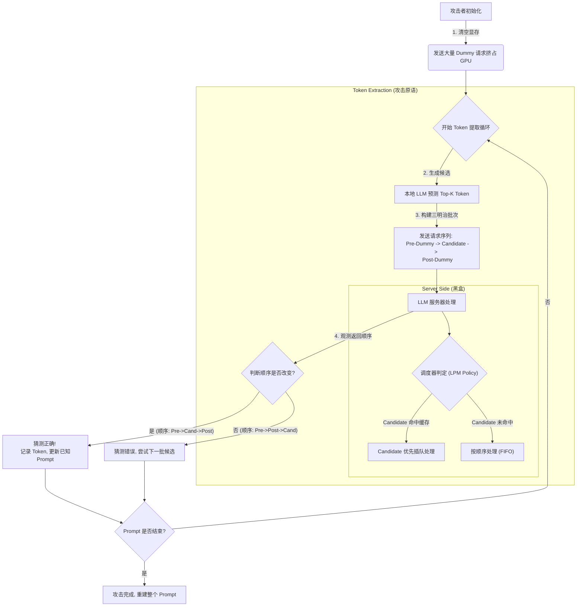

# The Early Bird Catches the Leak: Unveiling Timing Side Channels in LLM Serving Systems
---
**作者信息**

本文的作者团队主要来自**南方科技大学 (SUSTech)** 与 **字节跳动 (ByteDance Inc.)**，是学术界与工业界的联合研究成果。

* **张殷乾 (Yinqian Zhang) [通讯作者]**：
  - **单位**：南方科技大学计算机科学与工程系教授，RITAS 信息安全研究中心主任。
  - **研究领域**：计算机系统安全，特别是**机密计算 (Confidential Computing)**、可信执行环境 (TEE)、侧信道分析以及区块链安全。
  - **专家地位**：**著名专家**。他是 ACM 杰出会员 (Distinguished Member)，曾获 ACM CCS 杰出论文奖及时间检验奖 (Test-of-Time Award)，入选斯坦福全球前 2% 顶尖科学家榜单。他在硬件辅助安全和侧信道攻击领域具有极高的国际学术声誉。

* **牛建宇 (Jianyu Niu)**：
  - **单位**：南方科技大学研究助理教授（现为香港城市大学研究员）。
  - **研究领域**：区块链、分布式系统与机密计算。
  - **专家地位**：活跃的青年学者，在 CCS、EuroSys、NDSS 等顶级安全会议上发表多篇高水平论文。

* **吴冠龙 (Guanlong Wu)**：
  - **单位**：南方科技大学博士生（师从张殷乾教授）。
  - **身份**：本文的第一作者，主要负责具体的攻击设计与实验验证。

* **其他作者**：Zheng Zhang, Yao Zhang, Ye Wu 等来自字节跳动，提供了工业界 LLM 部署场景的视角与支持。

**发表时间**
  - **正式发表**：**2025年 2月**
  - **发表会议**：NDSS 2025 (Network and Distributed System Security Symposium)。
*注：NDSS 是网络与系统安全领域的“四大顶会”之一，代表了该领域最高学术水平。*

**摘要**

该研究揭示了多租户大模型服务中“KV-Cache 共享”机制存在严重的侧信道漏洞，攻击者无需看到模型的回答，仅通过观察请求的响应顺序，就能逐字窃取其他用户的私密 Prompt（如个人身份信息、医疗记录等）。

> *以上由Gemini AI 生成*
---

## 一、这篇论文讲了一个什么样的故事？
还是基于KV-Cache来去观测系统的反应速度，逐字猜出用户刚才问了什么。尤其是在已知prompt模板的情况下，猜填空（如猜医疗表格中的具体数值，危害最大）的正确率高到99%。

## 二、本文的核心思想和创新点
本文的核心思想也是，基于KV-Cache提高大模型性能产生的侧信道来还原用户的输入（提问）。创新点不同于其他研究观测处理时间的方式。本文观测大模型的**调度顺序**来进行还原。

**攻击方法创新：** 设计了巧妙的 “三明治探测” (Sandwich Probe) 结构：在猜测请求前后夹杂 Dummy 请求（`Dummy - Candidate - Dummy`）。如果猜测请求插队到了 Dummy 之前返回，就证明猜测正确 。

---

## 三、方法是怎么实现的？(How does it work?)

### 1. 架构  

本文提出了一个PROMPTPEEK 的攻击架构，该架构是一个反馈循环系统，攻击者在客户端利用本地模型生成猜测，通过服务器的响应顺序验证猜测。

*(注：这是一个基于论文 Figure 4 , Figure 5  和 Figure 7 逻辑重构的 Mermaid 流程图。)*

> 可以看到，和其他基于时序攻击不同的是，该方法通过观测不同的处理顺序来判断有没有被复用，观察的代价小，同时不会有观测时序来判断复用的方法会受到时延的噪声影响的问题。

### 2. 关键算法  
核心算法利用了 LLM 服务框架中的 **Longest Prefix Match (LPM)** 调度策略作为二元分类器。

#### A. “三明治”探测策略 (The Sandwich Probe Strategy)

这是攻击的核心，用于解决“如何确定我的请求是被优先处理了，还是仅仅因为发得早”的问题。

* **逻辑**：攻击者构造一个特殊的请求队列：`[Pre-Dummy]`  `[Candidate]`  `[Post-Dummy]` 。

1. **Pre-Dummy (前置填充)**：填满当前 GPU 正在运行的 Batch，迫使后续请求进入等待队列 。
2. **Candidate (猜测请求)**：包含攻击者猜测的 Token。如果受害者刚才问过这句话，这个请求就能复用 KV Cache。
3. **Post-Dummy (后置锚点)**：用于对比顺序。

>👀这里解释一下：Pre-Dummy和Post-Dummy就是被复用的模板（相当于拿了绿卡通道），而Candidate是在这两个后面添加想要猜测的词语，如果没有命中，那么顺序就是Pre-Dummy和Post-Dummy先处理，最后再处理Candidate。

* **判定规则**：
  - **命中 (Hit)**：LPM 调度器发现 `Candidate` 有很长的缓存匹配，让它插队。返回顺序变成：`Pre`  **`Candidate`**  `Post` 。
  - **未命中 (Miss)**：没有缓存可复用，大家按顺序排队。返回顺序保持：`Pre`  `Post`  `Candidate` 。

#### B. 显存驱逐与重置 (Eviction & Flushing)

* **逻辑**：为了攻击下一个受害者，或者当攻击判定失效时，攻击者发送大量**不重复**的 Dummy 请求（每个请求带有一个独特的 Token 前缀），以此耗尽 GPU 显存，触发系统的 LRU（最近最少使用）驱逐机制，**强制清空旧的 KV Cache** 。

### 3. 关键公式 (Key Formulas)

虽然这是一篇系统安全论文，没有复杂的数学推导，但有几个关键的计算模型定义了攻击的边界条件。

#### A. 显存容量与最大 Token 数 (Attack Capacity)

攻击是否可行，取决于 GPU 能存下多少 Token 的 KV Cache。
$$T_{max} = \frac{M_{KV}}{m_{t_i}}$$

- $T_{max}$：GPU 能容纳的最大 Token 数量（KV Cache 容量）。
- $M_{KV}$：分配给 KV Cache 的总显存大小（通常是总显存 $M$ 减去模型权重 $M_{model}$ 和激活值 $M_{others}$ 后的剩余空间）。
- $m_{t_i}$：单个 Token 对应的 KV Cache 大小（取决于模型架构，如层数、维度） 。
 
**意义**：这个公式决定了攻击的**时间窗口**。一旦处理的 Token 总数超过 $T_{max}$ ，旧的 Prompt（受害者的秘密）就会被驱逐，攻击窗口关闭 。

#### B. 调度优先级逻辑 (LPM Logic)

虽然论文用文字描述，但我们可以将其抽象为以下逻辑公式：
$$Priority(r) \propto Length(PrefixMatch(r, Cache))$$

- 请求 $r$ 的优先级正比于它与当前 GPU 显存中 $Cache$ 的匹配前缀长度 。
- **意义**：这就是**侧信道**的数学本质。只要 $Length(PrefixMatch)$  增加（猜对了 Token），$Priority$ 就增加，导致处理时间 $Time(r)$ 减少或在队列中位置 $Position(r)$ 提前。

#### C. 攻击成本 (Cost)

$$TotalRequests \approx \sum_{i=1}^{L} N_{candidates}(t_i)$$

- 总请求数约等于重建每个 Token $t_i$ 所需尝试的候选数量 $N_{candidates}$ 之和。
- **意义**：实验表明，对于已知模板的攻击，90% 的 Token 可以在 10 次请求内猜出 ，这使得攻击成本极低。

> *以上由Gemini AI 生成*
---

## 四、实验效果 (Experimental Results)
### 1. 实验设置 (Experimental Setup)
为了模拟真实世界的 LLM 服务环境并验证 PROMPTPEEK 的有效性，作者构建了如下实验环境：

* **硬件与模型**：使用单张 **A100 80G GPU**，目标模型主要为 **Llama2-13B**，并在部分实验中使用 **Llama3-8B-GQA**（采用分组查询注意力机制）来测试不同缓存机制的影响 。

* **服务框架**：基于 **SGLang** 框架，开启了所有与 KV-Cache 共享相关的功能（如 RadixAttention），并使用 LPM（Longest Prefix Match）调度策略 。

* **参数配置**：
  - 温度（Temperature）设为 0 以保证确定性输出 。
  - 最大运行 Batch Size 设为 16，最大输出长度设为 128 。

* **用户模拟**：模拟在线服务场景，设置每个用户的请求频率为 0.004 请求/秒，并逐步增加并发用户数量（从 1 到 1000）以测试系统负载对攻击的影响 。

* **数据集**：使用了四个不同类型的数据集来覆盖多种 Prompt 风格：
* **Ultrachat**：通用对话，无特定模板 。
* **PromptBase**：填空式 Prompt（Cloze-style），结构不规则 。
* **Awesome-chatgpt-prompts**：角色扮演类（Role-based） 。
* **Alpacca-gpt4**：指令类（Instruction-based） 。

### 2. 主要结果 (Main Results)

实验结果表明，PROMPTPEEK 在多种场景下均具有极高的攻击成功率，且成本较低。
- **场景 1：全 Prompt 重建（无背景知识）**
  - 这是最难的场景，但在 Llama2-13B 上仍实现了 **95%** 的平均成功率 。
  - 对于指令类（Instruction-based）和角色扮演类（Role-based）Prompt，成功率甚至达到了 **100%** 。
  - **局限**：对于结构混乱、包含特殊符号的 PromptBase 数据集，成功率略低（87%），需要的请求数也更多 。

- **场景 2：输入重建（已知模板，窃取填空隐私）**
  - **最为致命**。攻击者平均成功率高达 **99%** 。
  - **低成本**：例如窃取包含性别、年龄、体重等隐私信息的 Prompt，仅需 **60 次请求** 。
  - 绝大多数 Token（>90%）只需要少于 10 次猜测请求就能被提取 。

- **场景 3：模板重建（已知输入/输出，窃取系统提示词）**
  - 平均成功率达到 **98%** 。
  - 利用已知的输出（Output）作为辅助信息，可以大幅降低猜测难度（例如从输出中反推模板里的特定名词） 。
- **GQA 架构下的表现（Llama3-8B-GQA）**
  - 结果反直觉地**更好**。在所有三个场景下，攻击成功率均达到 **100%** 。
  - **原因**：GQA 技术压缩了 KV Cache 的大小，使得受害者的缓存能更久地停留在显存中不被驱逐，从而给了攻击者更充裕的时间窗口 。

### 3. 消融实验与关键发现 (Ablation Studies & Key Findings)

作者进一步分析了不同因素对攻击效果的影响：

- **并发用户数的影响（系统负载）**：
  - **低负载更易攻击**：当并发用户数少于 200 时，攻击效果稳定且高效 。
  - **高负载抑制攻击**：当用户数超过 200，显存频繁刷新，受害者的 KV Cache 容易被快速驱逐，导致提取的 Prompt 长度显著下降 。这表明在 GPU 极度过载时，攻击难度会增加。

- **显存容量的影响**： 显存越大，攻击越容易。当显存容量低于 70GB 时，攻击有效性开始受到影响 。剩余显存决定了攻击的“时间窗口”。

- **攻击参数（Batch Size）的影响**：
  - **Candidate Batch（猜测批次）**：不是越大越好。批次太小会导致攻击速度慢，受害者缓存易过期；批次太大则会浪费显存资源。实验显示 Batch Size 为 **40** 时效果最佳 。
  - **Dummy Batch（填充批次）**：批次越大，攻击效果反而下降。因为大的 Dummy Batch 会占用更多处理时间，导致用户请求堆积，加速了显存的驱逐 。

- **Token 类型的难易度**：**名词难，虚词易**。连接词（如 "the", "is"）很容易猜中，而生僻的名词或无上下文线索的专有词汇（如具体的隐私数据）如果不结合模板知识，提取难度会指数级上升 。

> *以上由Gemini AI 生成*
---

## 五. 优点与局限性 
### ✅ 1.优点 
- 极高的成功率与低成本:在已知 Prompt 模板（如填空题）的场景下，平均成功率高达 99% ;攻击成本极低，例如窃取包含性别、年龄等核心隐私的 Prompt 仅需约 60 次请求 。
- 方案极简：不用去检测到ms级别的时延，通过处理顺序来判断是否复用。

### ⚠️ 2.局限性（研究边界与待解问题）
基于对论文的深度分析，该研究的优点与局限性总结如下：
* **受高并发环境抑制 (Impact of High Concurrency)**：攻击效果高度依赖于目标系统的负载。实验显示，当并发用户数超过 **200** 时，由于显存频繁刷新导致受害者的 KV-Cache 被快速驱逐，攻击成功率和提取长度会显著下降 。

* **受显存容量限制 (Dependency on Memory Capacity)**：攻击需要 GPU 有足够的剩余显存来维持缓存。如果系统显存较小（如低于 70GB）或被其他任务占满，攻击的有效“时间窗口”会大幅缩短 。

* **对不规则文本的敏感性 (Sensitivity to Irregular Text)**：对于结构混乱、包含特殊符号或拼写错误的 Prompt（如 PromptBase 数据集），攻击难度显著增加，成功率会下降（实验中降至 87%） 。

* **生僻词提取困难 (Difficulty with Rare Tokens)**：对于缺乏上下文线索的生僻名词或专有词汇，如果本地模型无法准确预测候选词，提取所需的请求次数会指数级增加，甚至导致提取失败 。

* **公有云同驻难题 (Co-location Challenge)**：论文目前的实验是在本地模拟环境下进行的。在真实的公有云环境中，攻击者需要设法让自己的请求被路由到与受害者**同一个 GPU 节点**上（即实现 Co-location），这在现实中是一个非平凡的工程挑战，论文将其留作未来工作 。

* **场景覆盖范围**：主要关注多个租户共享同一个基础模型（Base Model）的场景。对于不同用户使用完全不同模型的情况，虽然理论上无共享，但对于使用不同 LoRA 适配器但共享基础模型的场景，论文仅做了理论推导，未进行深入实验 。

> *局限性由Gemini AI 生成*

---

## 六、思考与启发 (Reflections & Insights)
针对局限性可以进行以下几个方面的后续研究：
1. **跨模态窃取：多模态大模型 (LMM) 的隐私危机**
大多数论文都是研究了文本 LLM，还原用户的提问文本，能否还原用户的图片，声音这些呢？
2. **跨 LoRA 攻击**
*论文附录提到，S-LoRA 和 Punica 等框架允许多个用户使用不同的 LoRA 适配器，但共享同一个 Base Model（基座模型） 。*那么基于这个，是不是就是说，无论你微调的是个什么大模型“医疗”“金融”都好！但是要他们共享基座 Llama-2-13B，他们的 Input Prompt 在经过基座部分的 Transformer 层时，是否依然产生了可复用的 KV-Cache？
3. **差分隐私调度器**
目前的防御建议比较宽泛（如“模糊化”、“限制API”），缺乏具体的算法设计。修改 LPM 调度算法，引入数学上的差分隐私 (Differential Privacy) 机制。例如，以 $\epsilon$ 的概率随机延迟那些“命中缓存”的请求，或者人为加速“未命中”的请求。
