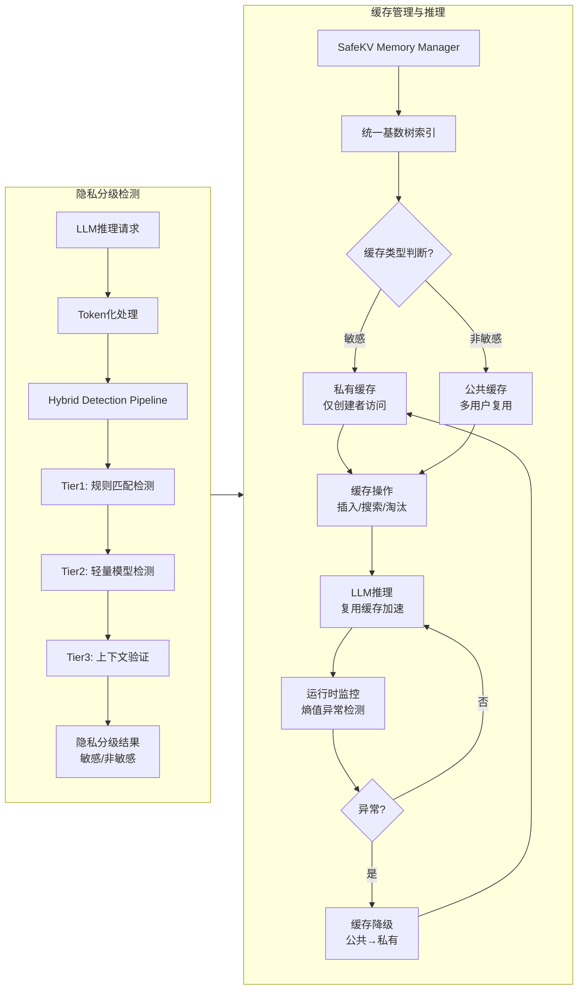

# Selective KV-Cache Sharing to Mitigate Timing Side-Channels in LLM Inference
---
**作者信息**
*   **Kexin Chu†** (康涅狄格大学, University of Connecticut, CT, USA)
*   **Zecheng Lin†** (独立研究员, Independent Researcher)
*   **Dawei Xiang** (康涅狄格大学, University of Connecticut, CT, USA)
*   **Zixu Shen** (康涅狄格大学, University of Connecticut, CT, USA)
*   **Jianchang Su** (康涅狄格大学, University of Connecticut, CT, USA)
*   **Cheng Chu** (印第安纳大学伯明顿分校, Indiana University Bloomington, IN, USA)
*   **Yiwei Yang** (加州大学圣克鲁兹分校, UC Santa Cruz, CA, USA)
*   **Wenhui Zhang** (独立研究员, Independent Researcher)
*   **Wenfei Wu** (北京大学, Peking University, Beijing, China)
*   **Wei Zhang\*** (通讯作者, 康涅狄格大学, University of Connecticut, CT, USA)

> **作者背景说明**：作者团队主要来自美国康涅狄格大学，同时涵盖了印第安纳大学、加州大学圣克鲁兹分校和北京大学的研究人员。其中 Kexin Chu 和 Zecheng Lin 为共同第一作者（†），Wei Zhang 为通讯作者（*）。

**论文发表时间** 
2025年8月11日 

**摘要**
SafeKV 提出了一个隐私感知的 KV 缓存管理框架，通过混合检测管道和统一基数树索引选择性共享非敏感条目并隔离敏感内容，从而在缓解时序侧信道攻击的同时，显著提升了相比完全隔离方法的推理性能。

> *以上由 GLM-4.7 AI 生成*
---

## 一、这篇论文讲了一个什么样的故事？
本文讲了一个破解 LLM 推理 “性能与隐私” 两难困局的技术故事。根据前面的几篇文章我们知道，由于KV缓存机制提高大模型性能的同时产生了相应的侧信道攻击方法。面对两难困境，本文提出了SafeKV 框架，给 KV 缓存条目做 “隐私体检” —— **敏感条目放进用户私有缓存隔离，非敏感条目放进公共缓存供多用户复用**，既保隐私又不丢性能。

---

## 二、本文的核心思想和创新点

### 1. 核心思想
本文的核心思想是打破“**为了安全必须牺牲性能**” 的传统观念。作者提出，通过对 KV 缓存块进行**细粒度的隐私感知分类**，可以实现“**选择性共享**”——即只共享非敏感的内容，隔离敏感的内容。这不仅消除了时序侧信道攻击的根源，还最大化了缓存复用的收益。

### 2. 关键创新点
- **混合多层级异步检测管道**：设计了`“规则匹配 + 轻量级通用 LLM + 在线大模型验证”`的三级漏斗式检测机制。先用规则匹配快速识别结构化敏感信息，再用轻量模型捕捉隐性敏感内容，最后依托服务端 LLM 做上下文验证，兼顾检测效率与精度，且异步执行不影响推理延迟。

- **统一隐私感知的基数树索引**：在传统的 Radix Tree 缓存索引中，引入了 `private_tag` 和 `creator_id` 元数据，在同一棵树中统一管理 Public 和 Private 节点。同时管理公私缓存条目，结合路径压缩和渐进式淘汰策略，既实现高效前缀匹配，又解决私有缓存碎片化问题，提升内存利用率。
 
- **基于熵值的运行时防御机制**：通过监测缓存块的访问熵值变化，及时发现并修正检测误判，将敏感内容泄露风险控制在极低水平。

---

## 三、方法是怎么实现的？(How does it work?)

### 1. 架构  
**整体架构概述**
SafeKV 采用模块化双层架构，核心由 **混合隐私检测管道**和 **SafeKV Memory Manager（隐私感知缓存管理器）** 组成，两者协同实现 “敏感内容隔离、非敏感内容共享” 的目标，整体流程如下：

>此架构流程主要参考自论文中的 Fig. 3: The Architecture Overview of SafeKV。

### 2. 关键算法  
SafeKV 的实现依赖于以下三个核心机制：
**A. 三层混合隐私检测**

为了解决准确性和延迟的矛盾，SafeKV 采用了分级筛选策略 ：
* **Tier 1：基于规则的模式匹配**：使用正则表达式和黑名单快速识别显性的敏感信息（如邮箱、电话、ID 等）。此阶段成本极低（每次请求约 0.2ms）。
* **Tier 2：通用隐私检测器**：使用轻量级 Transformer 模型（如 Llama-3.2-1B）来检测规则无法覆盖的语义隐私 。这是主要的检测路径，处理大多数请求 。
* **Tier 3：上下文感知验证**：对于前两层无法确定的复杂情况（如多轮对话中隐含的隐私），利用正在服务的**大模型本身**结合上下文历史进行验证 。

**B. 统一基数树缓存索引与路径压缩**

- **统一索引 (Unified Index):** SafeKV 修改了传统的基数树，在树节点中引入了`private_tag`（私有/公共标记）和 `creator_id`（创建者ID）。这使得公共和私有块可以在同一棵树中管理，但私有块仅对特定用户可见 。
- **私有树优化 (Private Tree Optimization):** 私有块通常形成线性的、无分支的路径。SafeKV 使用**路径压缩 (Path Compression)** 算法，将线性的私有节点路径压缩为一个逻辑节点（`pri_root`），减少内存碎片并加快查找速度 。

**C. 基于熵的运行时异常检测**

为了防止检测算法误判（False Negatives），系统在运行时监控 KV 块的访问模式 。它计算访问的**熵值**。如果一个被标记为“公共”的块长期仅被极少数特定用户访问（低熵），系统会将其视为可疑并触发回退机制（降级为私有或进行身份验证）。

### 3. 关键公式

**A. 隐私泄露概率**

SafeKV 通过多层级联来降低敏感信息被错误标记为“公共”的概率。假设 $\alpha_i$ 是第 $i$ 层检测器的假阴性率（False Negative Rate），则敏感块被泄露的概率 $P_{leak}$ 为：
$$P_{leak} = \prod_{i=1}^{3} \alpha_{i}$$

> **解释：** 这是一个连乘公式。实验表明，即便在最差情况下，$\alpha_1 < 0.63$, $\alpha_2 < 0.04$, $\alpha_3 < 0.29$，最终的泄露概率 $P_{leak}$ 小于 0.03 (3%) 。

**B. 访问熵**

为了在运行时检测潜在的误判，SafeKV 监控每个缓存块 $b$ 的熵值$\mathcal{H}_{b}$：
$$\mathcal{H}_{b} = \frac{u_{cnt}}{hit_{cnt}}$$
> **解释：**
> * $u_{cnt}$：访问该块的唯一用户数量。
> * $hit_{cnt}$：该块的总访问次数 。
> * **判定逻辑：** 较高的熵值意味着该块被广泛的不同用户访问，属于真正的“公共”知识；较低的熵值（特别是当  时）暗示该块可能包含了特定用户的私有信息，应被隔离 。
> 

**C. 时间侧信道攻击模型**

虽然这是攻击模型而非防御公式，但它定义了 SafeKV 试图消除的信号。攻击者通过测量首字生成时间 (TTFT) 来推断前缀是否命中缓存：
$$TTFT(r_a) = \begin{cases} 
T_{hit} & \text{if } C(t_{1},t_{2},...,t_{k}) = True \\ 
T_{miss} & \text{otherwise} 
\end{cases}$$

> **解释：** SafeKV 的目标是确保对于包含敏感信息的前缀，$C(...)$ 仅对所有者返回 True，对攻击者强制产生 $T_{miss}$ 的效果，从而消除 $T_{hit}$ 带来的时间差信号。
---

## 五. 优点与局限性 
### ✅ 1.优点 
本文的有点就是对应的三个关键算法：
- **A. 三层混合隐私检测**：SafeKV 保留了全局缓存共享的性能优势，通过选择性共享非敏感内容，显著减少了性能损失 。
- **B. 统一基数树缓存索引与路径压缩**：优化了内存使用并加速了查找过程 。
- **C. 基于熵的运行时异常检测**：即使静态检测出现误判，基于熵的访问监控机制也能在运行时检测异常访问模式，并将可疑块降级为私有，提供了额外的安全保障 。

### ⚠️ 2.局限性（研究边界与待解问题）
个人觉得局限性就是仍需要额外的计算资源来运行检测模型（例如 Tier-2 的 Llama-3.2-1B 模型大约需要 2.6GB 的 GPU 显存），这在成本极度敏感的场景下可能是一个考量因素 。
也就是说Tier-2 这个部分的开销是需要消耗显存的。

---

## 六、思考与启发 (Reflections & Insights)
针对局限性可以进行以下几个方面的后续研究：
1. **跨模态窃取：多模态大模型 (LMM) 的隐私危机**
大多数论文都是研究了文本 LLM，还原用户的提问文本，能否还原用户的图片，声音这些呢？
2. **跨 LoRA 攻击**
*论文附录提到，S-LoRA 和 Punica 等框架允许多个用户使用不同的 LoRA 适配器，但共享同一个 Base Model（基座模型） 。*那么基于这个，是不是就是说，无论你微调的是个什么大模型“医疗”“金融”都好！但是要他们共享基座 Llama-2-13B，他们的 Input Prompt 在经过基座部分的 Transformer 层时，是否依然产生了可复用的 KV-Cache？
3. **差分隐私调度器**
目前的防御建议比较宽泛（如“模糊化”、“限制API”），缺乏具体的算法设计。修改 LPM 调度算法，引入数学上的差分隐私 (Differential Privacy) 机制。例如，以 $\epsilon$ 的概率随机延迟那些“命中缓存”的请求，或者人为加速“未命中”的请求。

>和第4篇一样的看法。

