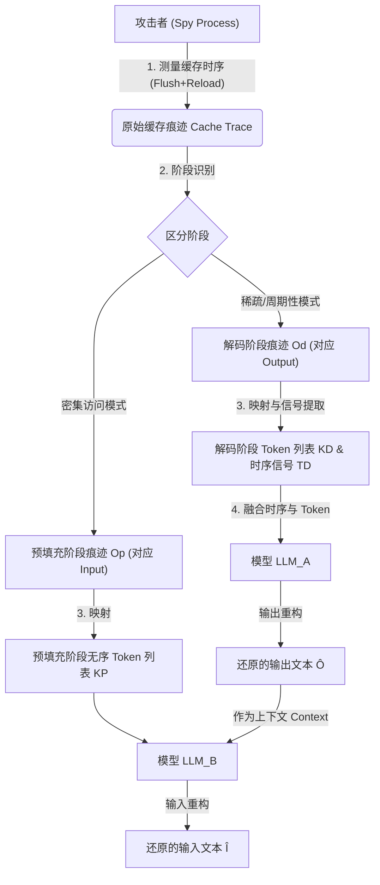

# I Know What You Said: Unveiling Hardware Cache Side-Channels in Local Large Language Model Inference
---
**作者信息**

* **主要作者**：Zibo Gao（高自博）、Junjie Hu（胡俊杰，通讯作者）、Feng Guo、Yixin Zhang 等。
* **所属机构**：
  - **中国科学院信息工程研究所 (IIE, CAS)**：这是中国在信息安全领域（如网络安全、密码学、系统安全）的顶尖研究机构之一。
  - **中国科学院大学网络空间安全学院 (UCAS)**。

* **研究背景**：该研究团队主要专注于**系统安全**、**硬件侧信道攻击**以及**人工智能安全**。通讯作者 **Junjie Hu** 在自然语言处理（NLP）和大模型（LLM）安全领域有较为活跃的研究成果（如在 ICML, ICLR 等顶级会议发表过相关论文），团队整体具备极强的底层硬件安全与AI算法结合的研究能力。

**论文发表时间**

* **2025年6月15日**（arXiv v3版本）。
> *注：论文左上角标记了 "USENIX ARTIFACT EVALUATED"，且在参考文献中提及 2024年的 USENIX Security，暗示该工作可能投稿或被录用于安全领域的顶级会议（如 USENIX Security 2025/2026）。*

**摘要**
本文揭示了一种针对本地部署大语言模型（LLM）的新型侧信道攻击框架，攻击者无需物理接触或特权，仅通过监测**Token嵌入操作的缓存访问模式**（泄露Token值）和**自回归解码的时序特征**（泄露Token位置），即可在不直接访问模型的情况下，高精度地还原用户的隐私输入和模型的输出文本（输出文本恢复的编辑距离仅为5.2%）。

> *以上由 Gemini3 Pro AI 生成*
---
## 一、这篇论文讲了一个什么样的故事？
与前面几篇同，本文的故事核心是人们原本以为将大模型（LLM）部署在本地就能确数据隐私安全，但是攻击者如果可以在你的电脑上运行一个不起眼的“间谍软件”，就能窃听你和 AI 的对话。

研究者发现，LLM 在推理时有两个看似平常但致命的特征，被硬件缓存出卖了：
- 1.**“查字典”泄露了内容（Token Embedding）**：模型将文字转换为数字时，需要查一张巨大的“嵌入表”。由于缓存容量有限，CPU 会不断地换入换出数据。攻击者通过观察缓存的访问位置，就能推断出模型刚刚查了哪个词（Token）；
- 2.**流式输出（时序问题）**：大模型是一个字一个字往外吐（自回归生成）。这种生成节奏在时间上非常规律，攻击者通过监测时间间隔，就能知道现在是在处理输入还是在生成输出，从而推断出文字的位置信息 。

但直接偷来的数据充满了“噪声”且是乱序的（特别是用户输入部分，因为是并行处理的，顺序被打乱了）。 为了还原词序，作者利用“**上下文关联性**”，把刚刚还原的输出作为线索，让另一个 LLM 像拼图一样，把打乱的输入关键词重新排列成通顺的句子 。

---

## 二、本文的核心思想和创新点

### 1. 核心思想
核心思想是本地部署的 LLM 虽然断网，但其运行极其依赖底层的 CPU 硬件资源。由于 CPU 缓存（Cache）容量有限，查表会产生特定的缓存访问模式。攻击者监控缓存行的变动，就能反推模型读取了词表中的哪个 Token 。此外由于LLM流式输出，通过分析时间间隔，攻击者可以确定 Token 的生成顺序 。

### 2. 关键创新点
**基于功率谱密度（PSD）的去噪算法**：本文发现 LLM 的解码阶段具有极强的周期性。他们引入了信号处理中的**功率谱密度（PSD）**分析，成功从嘈杂的缓存痕迹中提取出真实的 Token 生成节奏，有效过滤了随机噪声 。

---

## 三、方法是怎么实现的？(How does it work?)

这篇论文提出了一种针对本地大语言模型（LLM）的侧信道攻击方法，名为“I Know What You Said”。其核心是通过监控 CPU 缓存的访问模式来推断模型处理的 Token（词元），并利用专门微调的 LLM 还原出原始的输入和输出文本。

以下是该方法的详细实现说明：

### 1. 架构 (Architecture)
**流程图描述：**

>参考原文的**Figure 2: Workflow of our eavesdropping attack** 。该图展示了从缓存痕迹采集到文本重构的完整五个步骤。

### 2. 关键算法 (Key Algorithms)

该方法主要包含以下几个关键算法步骤：

**A. 缓存时序测量与抗干扰**
- **Flush+Reload 变体**：使用 Flush+Reload 攻击技术监控嵌入表（Embedding Table）的内存地址 。
- **对抗硬件预取器**：为了绕过 Intel Raptor Lake 架构上的 AoP（Array-of-Pointers）预取器导致的攻击失效，作者设计了一种新的地址访问策略，通过计算偏移量并在访问时动态还原地址，避免在数组中直接存储有效指针，从而骗过预取器 。

**B. 阶段识别**
- 利用自回归生成的特征区分“预填充（Prefill）”和“解码（Decode）”阶段：
  - **预填充阶段**：并行处理所有输入 Token，缓存命中极其密集 。
  - **解码阶段**：逐个生成 Token，缓存命中稀疏且有时间间隔 。

**C. 信号处理与噪声过滤**

- **功率谱密度 (PSD) 分析**：利用傅里叶变换分析解码阶段的时序信号。研究发现真实的解码信号具有强周期性（基频 ），而噪声（误报）则表现为白噪声 。
- **归一化一阶差分**：通过计算归一化的时间差分信号  来突出异常点。波峰通常对应“误报（False Positive）”（需去除），波谷对应“漏报（False Negative）”（需填补） 。

**D. 数据集合成**
由于攻击者无法接触受害者模型进行训练数据采集，作者通过在公开语料库文本上叠加模拟的高斯噪声、随机插入/删除 Token 来模拟真实的缓存侧信道痕迹 。

**E. 基于 LLM 的文本重构 (LLM-based Reconstruction)**
- **输出重构 ($LLM_A$)**：微调一个 LLM，输入是带有噪声的 Token 列表和时序信号，输出是清洗后的流畅文本 。
- **输入重构 ($LLM_B$)**：微调另一个 LLM，解决输入 Token 乱序的问题。它将**重构出的输出文本**作为上下文，推断并重新排列无序的输入 Token，还原原始 Prompt 。

### 3. 关键公式 (Key Formulas)

**1. 嵌入表地址计算**
为了定位特定 Token $i$ 在内存中的位置，需计算其在嵌入表 $A_i$ 中的地址 ：

* **行主序 (Row-major)**:
$$p_1 + p_2 + iDb \le A_i < p_1 + p_2 + (i+1)Db$$

其中 $D$ 是向量维度，$b$ 是元素大小 。

**2. 时序信号的傅里叶变换**
用于分析解码阶段的周期性：
$$F(\omega; T_D) = \int_{-\infty}^{\infty} T_D'(t)e^{-j\omega t}dt = \sum_{k=1}^{|T_D|} e^{-j\omega T_{D_k}}$$
其中 $T_D$  是缓存命中时间戳序列 。

**3. 归一化一阶差分**
用于预处理时序信号以去除周期性成分，使噪声特征更明显：
$$\hat{T}_{D_k} = f_0(T_D) \cdot (T_{D_k} - T_{D_{k-1}})$$
其中 $f_0(T_D)$  是估算出的基频（Token 生成速率）。

---

## 四、实验效果 (Experimental Results)

### 1. 实验设置 (Experimental Setup)
**硬件环境**：主要测试平台为搭载 **Intel Core i9-13900K** CPU 和 NVIDIA RTX 3060 GPU 的台式机。同时也测试了 Intel i9-14900K 和 i7-12700KF 以验证普适性 。

**受害模型**：测试了 5 种主流开源模型，包括 **Meta Llama-3.1-8B**、**Google Gemma2-9B**、**Microsoft Phi-3.5-mini**、**Mistral-7B** 和 **Falcon3-10B** 。

**受害框架**：评估了 10 种流行的 LLM 推理框架，如 **llama.cpp**、**HuggingFace Transformers**、**Ollama**、**GPT4All** 等 。

**攻击模型**：使用了 **GPT-4o-mini** 和 **Llama-3.1-8B-Instruct** 作为攻击者的基础模型（即 $LLM_A$ 和 $LLM_B$）。

**数据集**：训练和测试数据合成自公开数据集，包括 UltraChat、Natural Questions (NQ-Open)、SIQA、SQUAD2 和 ChatGPT-Roles 。

 **评估指标**：
* **ROUGE-1 (R1) / ROUGE-L (RL)**：评估 Token 级别的重叠度。
* **Levenshtein Similarity (LS)**：评估字符级别的编辑距离（1 - 编辑距离）。
* **Cosine Similarity ($\phi$)**：评估语义相似度（使用 AngleIE-Llama-7B 嵌入模型）。
* **攻击成功率 (ASR)**：语义相似度  $\phi > 0.77$ 的样本比例（基于人工评估设定的阈值）。

### 2. 主要结果 (Main Results)

实验结果表明，该攻击框架在还原模型输出和输入方面都极其有效，且具有很强的通用性。
**输出文本重构 (Output Reconstruction)**：
* **极高的还原度**：平均 Levenshtein 相似度 (LS) 达到 **96.3%**，语义相似度 () 高达 **98.7%** 。
* **精准窃取**：即使是训练集中未出现的专有名词（如 "Freddy Krueger"、"e5"），攻击也能完美复原，证明了其窃取具体隐私信息（PII）的能力 。
**输入文本重构 (Input Reconstruction)**：**语义还原出色**：虽然输入 Token 乱序导致字符级还原稍低（平均 LS 为 **82.7%**），但语义相似度 ($\phi$) 依然高达 **98.0%**，平均攻击成功率 (ASR) 达到 **99.9%** 。这说明攻击者几乎总是能理解用户的提问意图。

**广泛的框架脆弱性**：
* 在 CPU 推理场景下，测试的 **10 个框架全部沦陷** 。
* 在 GPU 加速场景下，除 HuggingFace Transformers（因完全在 GPU 上做 Embedding）外，其余 **9 个框架均被成功攻击** 。

**跨硬件与系统**：攻击在 Ubuntu、Windows 11 和 Docker 容器（Debian）中均有效，且在不同型号的 Intel CPU 上表现一致 。

### 3. 消融实验与关键发现 (Ablation Studies & Key Findings)

通过逐步移除攻击组件，作者验证了各个模块的重要性：
**1. 时序信号 ($T_D$) 至关重要**：在输出重构中，如果移除从缓存侧信道提取的时序信号，字符级还原度 (LS) 下降了 **12.7%**。这证明了利用“解码节奏”来辅助文本还原的必要性 。
**2. 上下文依赖是输入重构的核心**：在输入重构中，如果移除“已还原的输出文本”作为提示词上下文，还原度 (LS) 下降了 **17.1%**。这证实了利用“输出推导输入”策略来解决乱序问题的有效性 。
**3. AI 模型 $LLM_B$) 优于传统方法**：如果仅使用侧信道数据而不使用 $LLM_B$ 进行语义重组，输入还原度骤降 **46.4%**，说明大模型的语言理解能力是攻击成功的关键 。

---
## 五. 优点与局限性 
### ✅ 1.优点 
**首创性与全面性**：这是已知的第一个针对本地 LLM 推理的硬件缓存侧信道攻击，能够同时恢复模型的**完整输入（Prompt）和完整输出（Response）**文本 。
**合成数据**：提出了一种基于功率谱密度（PSD）的数据合成策略，利用公开语料库即可训练出有效的攻击模型 。
**算法创新解决“乱序”难题**：针对 LLM 并行处理导致输入 Token 乱序（Bag-of-Words）的问题，创新性地利用“已还原的输出”作为上下文线索，利用 $LLM_B$ 成功重组了输入文本的顺序 。

### ⚠️ 2.局限性（研究边界与待解问题）
**输入重构精度受限**：由于输入阶段（预填充）采用并行计算，导致时序信息丢失，攻击只能依赖上下文语义进行推断 。这使得输入文本在字符级和 Token 级的还原精度明显低于输出文本，难以完美复原缺乏强上下文关联的短语 。
**依赖共享内存与 CPU 执行**：攻击依赖 `Flush+Reload` 技术和 `mmap` 的零拷贝加载特性来探测共享内存 。如果系统禁用零拷贝、实施严格内存隔离，或者模型将 Embedding 操作完全放在独立 GPU 上（不涉及 CPU 交互），攻击将无法探测到信号 。
**防御代价高昂与扩展挑战**：现有的防御措施（如禁用零拷贝）会导致显著的性能下降（如增加 32% 的内存开销和 17% 的延迟），而硬件级隔离（如 Intel CAT）通常仅限于服务器级 CPU，在消费级设备上不可用 。此外，若转向不依赖共享内存的攻击（如 Prime+Probe），将面临巨大的搜索空间挑战 。

---

## 六、思考与启发 (Reflections & Insights)
针对局限性可以进行以下几个方面的后续研究：
本文有一个严重的问题就是越来越多的推理框架将 Token 嵌入操作迁移至独立显卡，这使得 CPU 缓存攻击失效 。这里能不能研究一下GPU层面的攻击。

