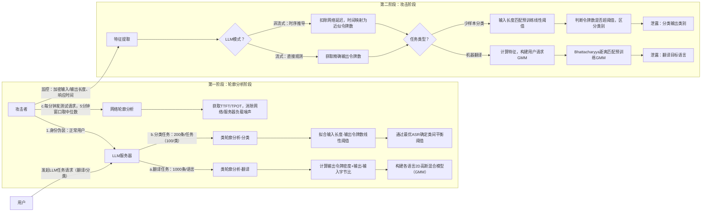

# Time Will Tell: Timing Side Channels via Output Token Count in Large Language Models
---
**作者信息**
- **Tianchen Zhang**: 多伦多大学电气与计算机工程系（ECE）的研究生。该论文似乎与其学位研究工作紧密相关，他是该文的第一作者。
- **Gururaj Saileshwar**: 多伦多大学计算机科学系助理教授，安全智能与可信系统实验室（SITH Lab）负责人。他是计算机架构与硬件安全领域的专家，尤其专注于微架构侧信道攻击与防御（如Rowhammer、Cache攻击等），曾获得 IEEE HOST 最佳博士论文奖，属于该领域的新星学者。
- **David Lie**: 多伦多大学电气与计算机工程系教授，IEEE Fellow，ACM 杰出科学家。他是系统安全领域的**顶级专家（大牛）**。他最著名的成就是关于 XOM（eXecute Only Memory）架构的开创性工作，这是现代可信执行环境（如 ARM TrustZone 和 Intel SGX）的雏形。他还曾获得操作系统顶级会议 SOSP 的最佳论文奖。

**论文发表时间**
- **2024年12月19日**（arXiv v1版本）。

**摘要**
* 本文揭示了一种针对大语言模型（LLM）的新型侧信道攻击，攻击者可以通过远程测量模型响应时间来推断输出Token的数量，进而利用Token数量与敏感属性（如机器翻译的目标语言偏好或文本分类的类别）之间的相关性，以高精度窃取用户的隐私信息。

> *以上由 Gemini3 Pro AI 生成*
---

## 一、这篇论文讲了一个什么样的故事？
本文所使用的测信道是大模型的**输出 Token 的数量**。

第一个故事是**不同语言在 LLM 眼中的“密度”是不同的**。由于分词器（Tokenizer）的偏差，表达同样的意思，不同语言所需的 Token 数量差异巨大 。例如，中文、韩语等语言可能非常精简（Token 密度低），而罗曼语族（如法语、西班牙语）可能比较啰嗦（Token 密度高） 。那么在**机器翻译**领域，攻击者不需要破解加密内容，只需要在旁边掐表计时。通过分析输入长度和输出时间的比例，攻击者就能猜出用户正在把文件翻译成什么语言（比如中文、俄语或印地语），从而推断用户的国籍或种族背景，准确率超过 75% 。

第二个故事是**模型在解释不同类别的结果时，话痨程度是不一样的**。例如，解释“为什么这条推文是悲伤的”可能比解释“为什么它是开心的”需要更多的 Token 。在**文本分类任务**（例如：情感分析、医疗诊断分类）的场景下，攻击者通过监测时间，就能知道模型给出的诊断是“阳性”还是“阴性”，或者用户的推文是“开心”还是“愤怒”。在 GPT-4o 上，这种攻击的成功率甚至达到了 74.7% - 86.9% 。

---

## 二、本文的核心思想和创新点

### 1. 核心思想
核心思想是根据大模型的**输出 Token 的数量**不同，可以得到一些信息。例如，通过分析输入长度和输出时间的比例，推断用户的国籍或种族背景，以及文本的主题情感等。

### 2. 关键创新点
本文的创新点关注大模型的**聚焦总响应时间与Token总数关系**，验证了以下几点假设：
1.不同的语言输出的Token 密度不同；
2.LLMs对不同类别的解释长度存在固有偏好；
3.few-shot示例设计对攻击效果的放大作用(平均提升15%成功率)。

---

## 三、方法是怎么实现的？(How does it work?)

### 1. 架构
攻击整体遵循**轮廓分析阶段**+**攻击阶段**的两阶段设计，支持**流式LLM（直接观测令牌数）**和**非流式LLM（通过响应时间推导令牌数）**两种场景，覆盖**机器翻译**和**少样本二分类**两大核心LLM任务，攻击者为网络层被动角色，仅能获取加密输入输出的长度、响应时间等元数据，无明文访问权限。

### 2. 关键算法  

**A. 输出令牌密度与输出-输入比计算算法**
- **输出令牌密度计算**：对于每个翻译请求，计算 `输出字节数 / 输出令牌数`，反映不同语言的令牌编码效率差异。研究发现资源匮乏语言（如中文、韩文）的令牌密度较低 。
- **输出-输入字节比计算**：计算 `输出字节数 / 输入字节数`，反映语言形态学差异导致的同语义表达长度差异。例如俄语具有较高的输出-输入比 。

**B. 高斯混合模型构建与匹配算法**
- **二维高斯混合模型构建**：为每种目标语言构建一个二维高斯混合模型，特征空间为（输出令牌密度，输出-输入字节比）。使用1000个训练样本进行轮廓分析，通过期望最大化算法拟合高斯分布参数 。
- **巴氏距离匹配**：在攻击阶段，基于用户多个翻译请求（1-50个）构建一个新的高斯混合模型，然后使用巴氏距离计算该模型与预训练语言GMM之间的相似度，预测最可能的目标语言 。

**C. 计时到令牌映射算法**
- **并发网络轮廓分析**：为消除网络延迟和服务器负载噪声，攻击者每分钟发送测试请求，测量时间到第一个令牌（TTFT）和每个输出令牌的时间（TPOT）。使用5分钟窗口取中位数以平滑异常值 。
- **令牌数量估计**：根据线性关系 `生成令牌 ∝ 生成时间`，通过测量总响应时间，减去估计的网络延迟和TTFT，再除以当前估计的TPOT，计算出近似的输出令牌数。实验表明该线性关系在本地模型中Pearson相关系数≥0.987 。

### 3. 关键公式 (Key Formulas)

**1.输出-输入字节比**
用于衡量输出与输入之间的长度比例，反映不同语言表达同一语义时的长度差异。

\[\text{Output-Input Ratio} = \frac{L_{\text{output}}}{L_{\text{input}}}\]

其中，\(L_{\text{input}}\) 是输入文本的字节长度。

**2.最优攻击成功率 (ASR)**
在分类任务中，为了平衡两个类别的预测精度，定义最优ASR。

\[\text{OptimalASR} = \frac{(Prec_1 + Prec_2)}{2} - \theta \cdot |Prec_1 - Prec_2|\]

其中，\(Prec_1\) 和 \(Prec_2\) 分别是对两个类别的预测精度，\(\theta\) 是超参数（论文中设为0.5），用于惩罚类别间精度不平衡。

**3.令牌数量估计公式**
在计时攻击中，通过测量总时间、网络延迟和预填充时间来估计输出令牌数。

\[\# \text{ of Estimated Tokens} = \frac{\text{Total Time} - \text{Network Latency} - \text{TTFT}}{\text{TPOT}}\]

其中，*TTFT（Time to First Token）* 和 *TPOT（Time Per Output Token）* 通过并发轮廓分析获得。

---

## 四、实验效果 (Experimental Results)

### 1. 实验设置 (Experimental Setup)
**翻译任务**：使用了三种多语言模型，分别是 **Tower** (基于 LLaMA-2 增强)、**M2M100** (Facebook 开发) 和 **MBart50** 。

**分类任务**：测试了开源模型 **Gemma-2** (2B, 9B, 27B)、**Llama-3** (3.1-8B, 3.2-3B)，以及闭源商业模型 **GPT-4o** 和 **GPT-4o-mini** 。

**数据集**：
- **翻译**：使用 **Flores-200** 数据集，包含多种源语言（英语、法语、西班牙语、俄语）和 13 种目标语言。使用训练集中的 1000 个样本进行画像分析（Profiling），测试集中的 50 个样本进行攻击评估 。
- **分类**：从 **Natural Instructions Dataset** 中选取了 12 个二分类任务。由于原数据集缺乏解释，作者使用 GPT-4-turbo 生成了合成解释用于少样本提示（Few-Shot Prompting）。

**攻击指标**：
- **翻译**：通过“输出 Token 密度”（Output Token Density）和“输出/输入长度比”（Output-Input Ratio）建立二维高斯混合模型（GMM）。
- **分类**：基于“输出 Token 数量”和“输入字节长度”拟合一个线性阈值来区分不同类别 。
- **评估标准**：攻击成功率（ASR），即攻击者正确预测目标属性（语言或分类标签）的精度 。

### 2. 主要结果 (Main Results)
**翻译任务攻击效果**：**特定语言几乎 100% 泄露**。对于形态特征明显的语言（如中文、俄语、韩语、印地语、阿拉伯语），由于其 Token 密度与拉丁语系差异巨大，攻击准确率接近 **100%** 。

**分类任务攻击效果**：**分类标签泄露**。攻击者能够成功通过解释的长度差异推断出分类结果（如情感的积极/消极）。在 GPT-4o 上，使用增强型少样本提示（Augmenting Few-Shot）时，平均攻击成功率高达 **86.9%**，GPT-4o-mini 甚至达到了 **93.1%** 。

### 3. 消融实验与关键发现 (Ablation Studies & Key Findings)

**增强型提示（Augmenting）**：如果提示中的示例（Examples）具有与模型固有偏见一致的长度差异（例如，正类解释短，负类解释长），攻击成功率平均提升 **15%** 。

**示例数量影响**：随着示例数量从 1-shot 增加到 3-shot，Gemma2-9B 的攻击成功率从 72.9% 提升至 79.2% 。

**抑制型提示（Diminishing）**：如果示例的长度差异与模型固有偏见相反，可以有效降低攻击成功率（平均降至 55%），这为防御提供了一种思路 。

**多维度指标的重要性**：在翻译攻击中，单独使用“Token 密度”或“输出/输入比”的成功率约为 70%，但结合两者（Combined Channel）后成功率提升至 **82.5%** 。

**模型大小无强相关**：攻击效果与模型参数量没有明显的线性关系。例如，小模型 GPT-4o-mini (93.1%) 的泄露风险比大模型 GPT-4o (86.9%) 更高 。

* **计时与 Token 数量的关系**：本地运行的开源模型中，生成时间与 Token 数量的线性相关性极高（Pearson 系数 > 0.98）。 商业模型（如 GPT-4o）的相关性较弱（约 0.37），但这主要是由于网络和系统负载波动造成的。通过**并发网络画像（Concurrent Network Profiling）**技术，攻击者可以有效校准这些噪音 。

---

