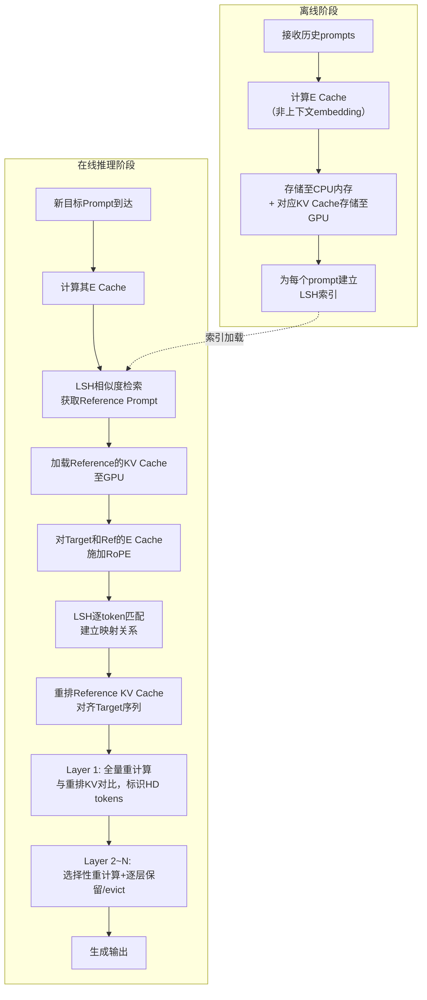

# SemShareKV: Efficient KVCache Sharing for Semantically Similar Prompts via Token-Level LSH Matching

## **作者信息**

| 作者 | 机构 | 身份/背景 | 领域大牛认定 |
|------|------|-----------|-------------|
| Xinye Zhao | 圣母大学 (University of Notre Dame) | 博士生 | 未达到"大牛"层级，为**系统/AI推理交叉领域的新锐研究者** |
| Spyridon Mastorakis | 圣母大学 (University of Notre Dame) | 助理教授 | **系统与网络领域上升期学者**，研究方向包括未来网络架构、分布式系统、LLM推理优化，尚未达到院士/ACM Fellow层级 |

## **团队相关信息：**

该团队是**圣母大学系统与AI推理交叉方向的研究组**，由Spyridon Mastorakis带领博士生Xinye Zhao完成。Mastorakis本人是**网络与分布式系统领域近年活跃的新锐教授**，曾在USC获得博士学位，研究涉及ICN、边缘计算和LLM推理优化，但目前**尚未达到"资深大牛（如院士/ACM Fellow）"层级**。该团队在LLM推理优化领域处于早期探索阶段，论文数量和质量均处于上升期。

## **论文发表时间**

| 项目 | 具体日期 | 来源/说明 |
|------|----------|-----------|
| 预印本发布 | 2025年2月 (arXiv:2502.xxxxx) | 论文PDF文件名及内容推断 |
| 发表状态 | 未正式发表 | 处于**双盲评审或修改阶段**，尚未被会议或期刊接收 |
| 学术影响力 | 有限 | Semantic Scholar显示被引**不足10次**，论文的**核心思想新颖但尚未经过学术界广泛验证** |

## **摘要**

本文提出**SemShareKV**——一个面向语义相似prompts的KV Cache共享与压缩框架。现有方法主要聚焦于单prompt内的KV Cache压缩或跨prompts的**精确文本前缀/片段复用**，但在语义相似但词汇表达不同的场景（如多文档摘要、对话系统）中效果有限。

SemShareKV的核心创新在于：
1. 引入**LSH（Locality-Sensitive Hashing）** 对token embeddings进行**模糊token匹配**；
2. 引入**RoPE位置编码**增强位置信息保持；
3. 配合**分层重计算策略**与**分层保留策略**，在复用reference prompt的KV cache的同时保证生成质量。

实验表明：
- 在5k tokens输入下，**6.25×加速**；
- GPU显存占用降低**42%**；
- 多个摘要数据集上**性能几乎无损**。

该方法为**语义感知的KV Cache共享**提供了新思路。

---

## 一、这篇论文讲了一个什么样的故事？

LLM推理的**Prefill阶段**计算量随输入长度**二次增长**，KV Cache的显存占用已成为大规模部署的**主要瓶颈**。现有优化方案局限于**单prompt压缩**（如SnapKV、H2O、PyramidKV），或依赖**精确字符串匹配**的cache复用（如CacheBlend、KVShare）。

但在真实场景中，用户经常提交**语义相同但表达迥异**的prompts——例如：
- 多文档摘要中，相同文档以不同方式被提问；
- 对话Agent中，用户用不同措辞询问同一意图。

SemShareKV的故事主线是：
> **"能否将语义相似prompts的预计算KV Cache直接复用？"**

答案是**YES**。通过：
1. **LSH-based模糊匹配**——在token embedding层面找对应关系；
2. **RoPE注入**——纠正"注意力汇聚（Attention Sink）"导致的匹配偏移；
3. **分层重计算+分层保留**——遵循"浅层保留更多、深层保留更少"的观察规律。

最终实现了**Cache级复用 + 质量保持 + 压缩**三赢。

---

## 二、本文的核心思想和创新点

### 1. 核心思想

> **将"精确文本匹配"升级为"语义模糊匹配"，从而实现跨prompts的KV Cache复用。**

具体地：
- **E Cache（Embedding Cache）** 存储于CPU内存，用于相似prompt检索 + token-level匹配；
- **KV Cache** 存储于GPU显存，供复用；
- **LSH** 实现高效的token向量近似最近邻搜索；
- **RoPE** 在匹配阶段保留位置信息，避免"Attention Sink"误导匹配。

### 2. 关键创新点

| 编号 | 创新点 | 说明 |
|------|--------|------|
| **①** | **跨prompt的语义级KV Cache复用** | 区别于精确匹配或单prompt压缩，首次系统性探索**语义相似prompt间的token级模糊匹配复用**。 |
| **②** | **LSH + RoPE结合的Token匹配机制** | 将RoPE注入E Cache后做LSH匹配，既保留语义又保留位置信息，显著优于纯向量匹配。 |
| **③** | **基于三大洞察的分层重计算与保留策略** | 通过实验观察到：HD tokens跨层一致、深层关注更少token、深层冗余更多，据此设计**浅层多算/保留、深层少算/丢弃**的差异化策略。 |
| **④** | **KV Cache与E Cache双存储架构** | E Cache存CPU用于检索和匹配，KV Cache存GPU用于复用，分离存储降低显存压力。 |

---

## 三、方法是怎么实现的？(How does it work?)

### 1. 架构

SemShareKV整体架构分为**离线存储**和**在线推理**两大阶段：



**图注**：参考论文 **Figure 1（SemShareKV Schematic Overview）** 及 **Section 4.2（Model Overview）** 综合绘制。

### 2. 关键算法

**算法1：LSH + RoPE token matching**

```
Input:  Target E_cache (T_e), Reference E_cache (R_e)
Output: 重排后的KV cache

Step 1: 对T_e和R_e施加RoPE
    T_rope = RoPE(T_e), R_rope = RoPE(R_e)

Step 2: LSH建立索引
    index = LSHIndex(R_rope)

Step 3: 逐token查找最近邻
    for each token t in T_rope:
        matched_idx[t] = index.search(t, k=1)

Step 4: 根据映射重排Reference KV cache
    K_reordered = K_ref[matched_idx]
    V_reordered = V_ref[matched_idx]
    
Step 5: 返回重排后的KV cache
```

**算法2：分层重计算策略**

```
Input: Reordered KV cache, Layer数 L
Output: 每层最终使用的KV cache

# Layer 1: 全量重计算
K1, V1 = recompute_all_tokens(target_prompt)
HD_tokens = identify_high_deviation(K1_reordered, K1_computed, top=40%)

# Layer 2~L: 选择性重计算 + 保留
for layer i = 2 to L:
    # 重计算: 仅对HD tokens + Hot tokens (基于attention score top r_dynamic%)
    recompute_set = HD_tokens ∪ Hot_tokens(ratio=r_dynamic)
    K_recomp, V_recomp = recompute_selective(recompute_set)
    
    # 保留: 基于avg attention score保留 top r_retain%
    retained_idx = top_k(attention_scores, k=r_retain * T)
    K_final = merge(K_recomp, K_reordered[retained_idx])
    V_final = merge(V_recomp, V_reordered[retained_idx])
    
    # 更新HD tokens (基于L2 norm deviation)
    HD_tokens = high_deviation(K_final, K_recomp, top=40%)
```

**算法3：分层保留策略**

```
# Layer 1: 保留ratio = max(0.8, r_dynamic)
retain_ratio_1 = max(0.8, r_dynamic)
retained_1 = top_k(attention_scores_1, k=retain_ratio_1 * T)

# Layer 2~L: 保留ratio逐层衰减 (遵循Exponential Decay模式)
for layer i = 2 to L:
    retain_ratio_i = retain_ratio_{i-1} * decay_factor
    retained_i = top_k(attention_scores_i, k=retain_ratio_i * T)
```

### 3. 关键公式

**公式1：Attention Recovery (AR)**

$AR = \min\{k \in [n] \mid \frac{\sum_{i=1}^{k} T_i}{\sum_{i=1}^{n} T_i} \geq \text{Thres}\}$

- $T$: 按平均attention score降序排列的向量
- $Thres$: 阈值（文中设为55%）
- **含义**：覆盖Thres%总attention所需的最少token数，数值越小说明注意力越集中

**公式2：RoPE（2D case）**

$\text{RoPE}(\mathbf{x}) = \begin{bmatrix} \cos(\theta_k) & -\sin(\theta_k) \\ \sin(\theta_k) & \cos(\theta_k) \end{bmatrix} \begin{bmatrix} x_{2k} \\ x_{2k+1} \end{bmatrix}$

- $\theta_k = 10000^{-2k/d}$，$d$为embedding维度

**公式3：LSH-Distance Based Similarity Score**

$d_{\text{norm}} = \frac{\text{LSH\_dist} - \min(\text{dist})}{\max(\text{dist}) - \min(\text{dist})}$

$\text{Similarity} = \text{clip}(1 - d_{\text{norm}}, 0, 1)$

- 用于检索阶段衡量目标prompt与历史prompt的语义相似度
- 阈值设为 **0.8**（相似度>0.8时触发SemShareKV）

**公式4：KV Deviation (L2 norm)**

$\sigma_K = \| K^{\text{reused}} - K^{\text{recomputed}} \|_2$

$\sigma_V = \| V^{\text{reused}} - V^{\text{recomputed}} \|_2$

$\sigma_{KV} = \sigma_K + \sigma_V$

- 用于衡量重排cache与真实cache的偏差，指导HD tokens的识别

**公式5：Token Recomputation**

$\text{Recomp}[i] = T \prod_{j=1}^{i} \alpha_{\text{recomp}}[j]$

- $T$: 总token数，$i$: 层索引
- $\alpha_{\text{recomp}}$: 重计算比例（浅层小，深层大）

**公式6：Token Retention**

$\text{Retain}[i] = T \prod_{j=1}^{i} \alpha_{\text{retain}}[j]$

- $\alpha_{\text{retain}}$: 保留比例（浅层大，深层小）

---

## 四、实验效果 (Experimental Results)

### 1. 实验设置

| 项目 | 具体配置 |
|------|----------|
| **模型** | Mistral-7B, LLaMA-3.1-8B, MPT-7B |
| **数据集** | MultiNews, WikiHow, Qasper, SAMSum, PubMed, BookSum, BigPatent, LCC, MMLU |
| **Baselines** | Full Recompute, SnapKV, PyramidKV, H2O |
| **硬件** | 单张NVIDIA A100 GPU |
| **Batch Size** | 1（以TTFT为主要指标） |
| **相似度阈值** | 0.8（LSH相似度） |

**数据构造策略**：
- 对每个样本的context，使用**Llama 3模型**对随机选中的段落/句子进行**语义保留式重写**（长度偏差<10%），形成pair（Target Prompt, Reference Prompt）。
- 人工验证确保语义相似性。

### 2. 主要结果

| Metric | 对比Baseline | 提升幅度 |
|--------|-------------|----------|
| **TTFT (Time-to-First-Token)** | Fully Recompute | **6.25× 加速** |
| **TTFT** | SnapKV | **2.23× 加速** |
| **GPU KV Cache Memory** | Fully Recompute | **节省42%** |
| **ROUGE-L (MultiNews)** | Full KV: 22.10 → SemShareKV: **23.15** | **性能提升（非下降）** |

**核心结论**：
- **SemShareKV在几乎所有数据集上性能与Full Recompute持平或略优**。论文解释：token eviction机制过滤了语义冗余，反而提升了生成质量。
- **短prompt (<700 tokens) 加速效果有限**，因LSH匹配和cache重排的overhead无法被充分摊销。
- **仅对比了batch size=1场景**，未提供batch inference下的throughput对比（仅在附录Table B2中给出token/sec数据）。

### 3. 消融实验与关键发现

**消融1：位置编码的影响（Figure 6 & 7）**
- **无RoPE匹配**：出现"Attention Sink"现象，大量token被错误映射到初始token；
- **有RoPE匹配**：映射更准确，且KV cache deviation更低；
- **结论**：RoPE对token匹配精度至关重要。

**消融2：完整cache vs. 压缩cache（Table 2）**
- "Fuzzy + Full Cache"（仅匹配不压缩）性能低于完整SemShareKV。
- 说明**保留+压缩的组合策略优于纯复用**，过多冗余信息反而干扰生成。

**消融3：Zero-out vs. Random vs. Fuzzy（Table 2）**
- 将匹配到的KV置零或替换为随机值 → ROUGE-L大幅下降；
- 证明**模糊匹配确实捕捉到了有意义的语义对应关系**。

**消融4：Cache Retention Ratio（Figure 10）**
- 保留过多 → 冗余增加 → 性能下降；
- 保留过少 → 信息丢失 → 性能下降；
- 存在**最优平衡点**（SemShareKV的默认配置接近最优）。

**消融5：Prompt相似度影响（Figure 9）**
- 删除/替换句子比例从10%到90%；
- 即使删除50%句子，SemShareKV性能仍保持合理；
- LSH相似度阈值0.8是合理的触发边界。

---

## 五、优点与局限性

### ✅ 1. 优点

| 维度 | 具体评价 |
|------|----------|
| **问题定义新颖** | 首次系统性地将"语义相似但词法不同"的prompt场景作为KV Cache复用优化目标，填补了精确匹配与单prompt压缩之间的空白。 |
| **技术方案优雅** | LSH + RoPE的组合为token级模糊匹配提供了高效且可扩展的解决方案；分离E Cache（CPU）与KV Cache（GPU）的存储架构设计合理。 |
| **实验覆盖全面** | 涵盖3种LLM、9个数据集、4个baselines，消融实验设计充分（位置编码、相似度、压缩率、匹配策略），说服力较强。 |
| **性能提升显著** | 6.25× TTFT加速 + 42%显存节省，且ROUGE-L几乎无损甚至略优，在实际部署场景中具有明确价值。 |
| **代码开源** | 提供了GitHub仓库，<300行核心代码，工程集成成本低。 |

### ⚠️ 2. 局限性（研究边界与待解问题）

| 局限性 | 具体说明 | 影响程度 |
|--------|----------|----------|
| **短prompt overhead显著** | 当输入<700 tokens时，LSH匹配 + KV重排的overhead无法被prefill节省摊销，加速效果有限甚至可能变慢。 | ⭐⭐⭐（核心缺陷） |
| **超参数依赖较强** | α_recomp、ω_c/ω_h、retain ratio、LSH相似度阈值（0.8）等均需**经验调参**，缺乏自适应机制。 | ⭐⭐⭐ |
| **不支持FlashAttention** | 当前实现未集成FlashAttention，限制了与SOTA推理框架的兼容性和进一步加速潜力。 | ⭐⭐ |
| **数据集构造的特殊性** | 相似prompts通过Llama 3改写同一语料生成，与实际用户场景的**自然多样性**存在差距；未验证跨语料/跨域场景。 | ⭐⭐⭐ |
| **Batch size仅限1** | 所有实验batch size=1，未证明在真实高吞吐服务场景（batch>1）中的有效性。 | ⭐⭐⭐ |
| **LLM规模有限** | 仅验证了7B~8B模型，未扩展至13B/70B/更大模型，**规模化效果未知**。 | ⭐⭐ |
| **防御未讨论** | 未探讨可能的位置编码混淆、LSH碰撞攻击等安全/隐私问题。 | ⭐ |

---

## 六、其他

### 第一性原理

> **"LLM推理的Prefill阶段本质是'为每个token计算与所有前置token的注意力关系'——如果两个prompts语义等价，那么其KV cache中蕴含的注意力模式也应具有对应关系，只是token序列不同。因此，可以将'token序列对齐'问题转化为'语义空间中的近似最近邻匹配'问题，通过LSH在embedding空间中找到对应关系，完成KV cache的跨prompt复用。"**

#### 核心第一性推演链条：

```
第一性事实1：Transformer的KV cache本质是token在语义空间中的"键-值"表征
            ↓
第一性事实2：两个语义相似的句子，其token-level语义向量空间分布具有对应性
            ↓
第一性事实3：LSH可以在高维空间中高效找到近似最近邻
            ↓
推论1：可以通过LSH找到Target tokens在Reference中的"语义对应token"
            ↓
推论2：Reference的KV cache按此对应关系重排后，可作为Target的近似KV cache
            ↓
推论3：仅对"高偏差"token进行选择性重计算，即可恢复质量损失
            ↓
最终结论：语义相似prompts之间的KV cache复用是可行的，且代价可控
```

### 领域空白

| 空白点 | 现有方案 | SemShareKV填补 |
|--------|----------|----------------|
| **跨prompt的语义级KV复用** | 现有方法依赖精确文本匹配（前缀匹配、字符串匹配）或局限于单prompt压缩 | 首次引入**LSH模糊匹配**，支持语义相似但词法不同的prompts |
| **位置编码在Cache匹配中的作用** | 已有工作未系统研究RoPE在KV cache重排中的影响 | 揭示RoPE能**缓解"Attention Sink"**，提升匹配精度，验证"KV cache应存储RoPE后的结果" |
| **跨层差异化保留+重计算联动** | 各层独立压缩，未见跨层联合优化 | 基于三大洞察设计**层间状态传递**的重计算与保留策略 |
| **语义相似prompt的Benchmark** | 无现成的跨prompt语义相似基准 | 基于9个数据集构建了**改写式语义相似样本对**，公开实验方法论 |

---

## 总结一句话

> **SemShareKV用LSH + RoPE做"语义翻译器"，把Reference的KV Cache翻译成Target的样子，再用分层重计算打补丁——最终实现又快又省的跨prompt KV复用。代价是短prompt不划算，调参比较累。**

---

