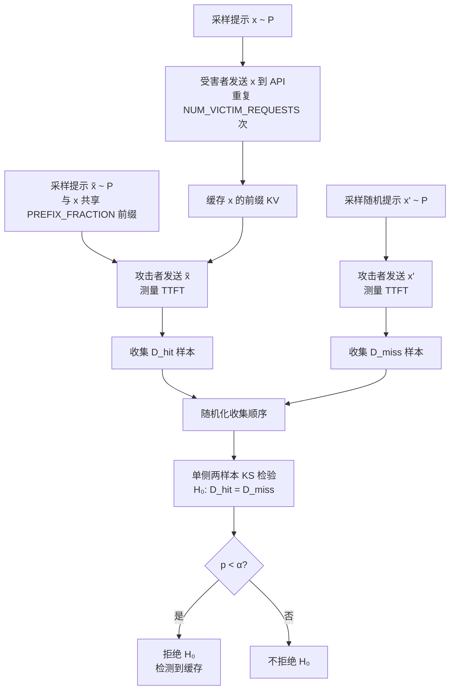

# Auditing Prompt Caching in Language Model APIs

**中文译名**：审计语言模型 API 中的提示缓存

**一句话总结**：针对 LLM API 提示缓存可能导致的时序侧信道隐私泄露，提出基于统计假设检验的审计方法，在 17 个真实 API 提供商中检测到 8 家存在提示缓存、7 家存在全局缓存共享，并据此推断 OpenAI 嵌入模型为 decoder-only 架构。

**论文类型**：实证与系统安全类（非理论论文）

**阅读材料与版本**：PDF 全文共 20 页（含附录），内容涵盖正文 §1–§8、参考文献及附录 A–D。未能访问代码仓库中的具体实现文件，以下技术分析均基于论文文本。

**论文链接 / DOI**：arXiv:2502.07776v2；DOI 10.5555/3780338.3781132（ACM DL）

## 作者与团队信息

### 1. 作者信息

| 作者 | 论文署名机构 | 可核验的身份或研究背景 | 与本文相关的代表工作或学术资历 | 来源 |
|---|---|---|---|---|
| Chenchen Gu | Stanford University | 斯坦福大学研究者，邮箱 cygu@stanford.edu | 与本文作者群合著 *On the Learnability of Watermarks for Language Models* (2024) |  |
| Xiang Lisa Li | Stanford University | 斯坦福 PhD candidate，由 Percy Liang 和 Tatsunori Hashimoto 共同指导 | EMNLP Best Paper 获得者，Two Sigma PhD Fellowship |  |
| Rohith Kuditipudi | Stanford University | 论文署名机构为 Stanford University；论文未提供更多个人背景信息 | 论文未报告 | 论文署名（Page 1） |
| Percy Liang | Stanford University | 斯坦福计算机科学副教授，CRFM（基础模型研究中心）主任 | 2019 年 PECASE 奖；本文合作者 Xiang Lisa Li 与 Tatsunori Hashimoto 的学术导师 |  |
| Tatsunori Hashimoto | Stanford University | 斯坦福计算机科学助理教授，Stanford NLP Group 核心 faculty | MIT 博士，曾在 Stanford 跟随 Percy Liang 和 John Duchi 做博士后 |  |

五位作者均来自斯坦福大学。**Percy Liang 是 Xiang Lisa Li 和 Tatsunori Hashimoto 的共同学术导师**，团队在 LLM 安全与可靠性、基础模型评测方面有持续积累。论文在 “Conflicts of Interest” 部分披露：PL 是 Together AI 的联合创始人，但声明该工作以斯坦福身份完成，方法、审计的提供商和结果均未受 Together 影响或提前共享。

### 2. 团队相关信息

该团队依托 Stanford CRFM 和 Stanford NLP Group，长期关注基础模型的**安全性、可靠性、水印与评测**。Xiang Lisa Li 的研究方向为“使语言模型更可控”，Tatsunori Hashimoto 关注 ML 模型的平均性能与最坏情况权衡，Percy Liang 主导基础模型的多维度评估。本文与团队既有工作的关系：将**统计假设检验的严谨性**从模型评测延伸至系统安全审计——此前团队在水印可学习性方面的工作同样关注“用统计方法检测模型行为中的可观测信号”，本文则将这一方法论迁移至 API 时序侧信道场景。无跨机构合作。

## 论文时间与发表状态

| 事项 | 日期或状态 | 来源与核验说明 |
|---|---|---|
| 预印本首次公开 | 2025 年 2 月 11 日 | arXiv:2502.07776v1 |
| 当前阅读版本发布或更新 | v2（PDF 内容） | 用户提供的 PDF，标注 “2502.07776v2” |
| 接收情况 | 已被 ICML 2025 接收 | ICML 官网及 arXiv 页面均标注 “Accepted at ICML 2025” |
| 正式发表 venue 与时间 | ICML 2025（第 42 届），ACM DL 页面显示 2025 年 7 月 13 日 | ACM DL 发表记录 |

**代码与数据**： https://github.com/chenchenygu/auditing-prompt-caching

## 摘要解读

LLM 的**提示缓存（prompt caching）** 通过在请求间复用注意力 KV 缓存来加速推理，但产生了**数据依赖的时序差异**——缓存命中的提示处理更快。若缓存跨用户共享，攻击者可利用快速响应时间识别已缓存提示，从而推断其他用户的提示内容。论文开发了一套**统计审计（statistical audit）** 方法，在 17 个真实 API 提供商中检测提示缓存及其共享级别。结果：8 家被检测到缓存，7 家存在**全局缓存共享**（包括 OpenAI），构成潜在隐私泄露。此外，通过检测提示前缀缓存，论文推断 OpenAI 的 text-embedding-3-small 模型为 **decoder-only Transformer** 架构——此前未公开。

## 一、这篇论文讲了一个什么样的故事？

**现实背景**。LLM 推理计算开销大，业界广泛采用提示缓存来加速——当新提示与已缓存提示共享前缀时，可直接复用注意力 KV 缓存。但这引入了一个隐蔽的安全问题：缓存命中的响应时间显著短于缓存未命中，而时间差是可观测的。

**已有方法的缺口**。虽然 Anthropic 和 OpenAI 公开了缓存策略，但**大多数 API 提供商不披露是否缓存、缓存是否跨用户共享**。已有的缓存侧信道研究（如 Song et al. 2024）在受控的本地环境中验证了攻击可行性，但缺乏对真实 API 的实用审计方法，也未提供统计保证。

**核心洞察**。作者意识到：如果能够**在统计上严格地比较“试图制造缓存命中的响应时间”与“制造缓存未命中的响应时间”** ，就能以可控的假阳性率判定缓存是否存在。更进一步，通过控制“受害者用户”和“攻击者用户”的身份关系，可以精确区分**每用户 / 每组织 / 全局**三个级别的缓存共享。

**解决路径**。设计两套提示构造程序：一套试图产生缓存命中（受害者先发提示使其入缓存，攻击者再发共享前缀但不同后缀的提示），一套产生缓存未命中（攻击者发随机提示）。在“无缓存”零假设下，两套程序的响应时间分布相同；用单侧 Kolmogorov-Smirnov 检验检测分布差异，输出有效 p 值。

**验证结果**。在 17 个真实 API 上执行审计，检测到 8 家缓存，7 家全局共享。缓存命中与未命中的时间分布在多数 API 中**清晰可分**（平均精度约 0.8）。辅助发现：OpenAI 嵌入模型的快速响应时间伴随**嵌入向量偏移**，这与 KV 缓存复用中的浮点非确定性一致，间接支持 decoder-only 架构推断。

**研究意义**。这项工作将**缓存侧信道从理论风险推向可操作的审计实践**，并展示了时序侧信道不仅能泄露用户数据，还能泄露**模型架构这类知识产权信息**。

## 二、本文的核心思想和创新点

### 1. 核心思想

本文最关键的设计选择是：**将缓存检测问题形式化为两样本分布检验问题**，而非依赖单次测量的阈值判断。具体而言，作者构造了两套**提示采样程序**——一套在统计意义上“倾向于产生缓存命中”，一套“保证产生缓存未命中”——然后检验二者的响应时间分布是否相同。这一选择的威力在于：零假设下的分布相同性提供**可计算的假阳性率控制**（通过 KS 检验的 p 值），无需假设响应时间的具体分布形式。

第二个关键选择是**用“共享前缀但不同后缀”的提示来探测缓存**。这比“精确匹配提示”更强：在 decoder-only Transformer 中，前缀共享的 KV 缓存复用是精确的（后续 token 的注意力只依赖前缀），因此缓存命中必然发生；而在 encoder-only 模型中，前缀缓存不可能实现。这一选择将缓存检测与**架构推断**绑定。

去掉统计检验框架，方法退化为启发式的“时间阈值判断”，失去假阳性率保证，在噪声环境下不可靠。去掉“共享前缀”设计，只能检测精确匹配缓存，无法区分缓存共享级别，也无法推断架构。

### 2. 关键创新点

| 创新点 | 最相关的已有做法 | 本文具体改变了什么 | 支撑证据 | 新颖性或适用范围的边界 |
|---|---|---|---|---|
| **可审计的统计假设检验框架** | Song et al. (2024) 在本地模拟中验证缓存时序攻击 | 将缓存检测从“攻击可行性演示”转变为**带假阳性率保证的审计工具**，输出有效 p 值 | §3.1–3.2 的形式化定义；Table 3–6 报告大量 p 值远小于 α=10⁻⁸ | 依赖 KS 检验的独立性假设；提示顺序随机化是必要条件 |
| **三级缓存共享的精确区分** | 已有工作未系统区分缓存共享级别 | 通过控制受害者/攻击者的**用户与组织身份**，分别测试 per-user / per-org / global 三级 | Table 1 显示 per-org 和 global 可被区分；Anthropic 和 OpenAI 的结果与其文档一致 | 需要创建多个用户和组织账户；部分 API 不支持组织功能 |
| **真实世界的大规模审计** | 此前无对真实 API 的系统性审计 | 审计 17 家提供商，覆盖 chat 和 embedding 模型；报告完整的 p 值表（Table 3–6） | §4.2，Table 1–2；7 家检测到全局共享 | 审计时间为 2024 年 9–10 月，结果可能随提供商更新而变化 |
| **通过缓存时序推断模型架构** | 无此前工作利用缓存侧信道推断架构 | 检测到 OpenAI 嵌入模型的前缀缓存 → 推断为 decoder-only | §5；附录 D 显示快速响应伴随嵌入向量偏移 | 仅适用于 embedding 模型（chat 模型几乎均为 decoder-only，推断无额外信息量） |

## 三、方法是怎么实现的？

### 1. 问题定义与关键假设

**输入**：一个 LLM API 端点，支持发送任意提示并测量响应时间。**输出**：关于该 API 是否缓存提示、以及缓存共享级别的统计判定。

**研究目标**：在给定显著性水平 α 下，检验零假设 H₀：“API 不缓存提示（在该共享级别上）”【§3.1】。形式化地，H₀ 等价于 D_hit = D_miss，其中 D_hit 和 D_miss 分别是“试图产生缓存命中”和“试图产生缓存未命中”两套程序的**响应时间分布**。

**关键假设**：
1. 可以发送任意提示（有长度上限），并测量**首 token 时间（TTFT）** 。通过设置 max_tokens=1，整体响应时间等于 TTFT。
2. 缓存命中发生在**提示前缀精确匹配**时；缓存命中比未命中**倾向于更快的 TTFT**（在控制提示长度后）。
3. 提示以有限时间驻留缓存；缓存可能分布在多个服务器上，请求路由可能随机或确定性。
4. 攻击者能够创建至少两个用户账户（以及组织，如果支持的话）。

**威胁模型**：攻击者是 API 的合法用户，但不具备服务端访问权限。攻击者能够测量客户端或服务端响应时间，发送任意提示，并创建多个账户。防御目标是保护其他用户的提示内容不被推断。

### 2. 整体架构

*图注：根据论文 §3.1–3.2 重绘的解释图，非原文原图。*

### 3. 关键模块与算法

| 步骤或模块 | 输入 | 核心操作 | 输出 | 为什么需要它 |
|---|---|---|---|---|
| **提示采样** | PROMPTLENGTH 参数 | 从均匀分布采样大写/小写英文字母，空格分隔 | 提示 x ∈ P | 保证 token 长度精确已知，避免 BPE 分词歧义；随机字母使前缀碰撞概率极低（15 token 共享概率 < 10⁻²⁵） |
| **缓存注入** | 提示 x，受害者账户 | 受害者连续发送 x 共 NUM_VICTIM_REQUESTS 次 | x 的 KV 缓存被存入 | 多次发送是为了应对多服务器路由——确保足够多的服务器缓存了 x |
| **命中探测** | 提示 x，PREFIX_FRACTION | 构造 x̃，与 x 共享 PREFIX_FRACTION × PROMPTLENGTH 个 token 的前缀，后缀不同 | 攻击者发送 x̃，测量 TTFT | 共享前缀是缓存命中的必要条件；不同后缀排除“精确匹配”这一平凡情况 |
| **未命中测量** | 随机提示 x‘ | 攻击者发送 x’，测量 TTFT | D_miss 样本 | 提供基线分布；随机提示几乎不可能与任何已缓存提示共享长前缀 |
| **统计检验** | D_hit 和 D_miss 样本 | 单侧两样本 KS 检验，检验 D_hit 是否随机小于 D_miss | p 值 | 非参数检验，不假设分布形式；单侧方向反映缓存命中应更快 |

**审计的四个级别**【§4.1】：
1. **Same prompt, per-user**（PREFIX_FRACTION=1，同一用户）：过滤掉不缓存精确匹配的 API。
2. **Per-user, shared prefix**（PREFIX_FRACTION=0.95，同一用户）：检测同一用户内的前缀缓存。
3. **Per-organization**（不同用户，同一组织）：检测组织内跨用户共享。
4. **Global**（不同用户，不同组织）：检测全局共享。

**多重检验校正**：每个级别内 NUM_VICTIM_REQUESTS ∈ {1, 5, 25} 逐次测试，Bonferroni 除以 3；若同时有 client-side 和 server-side timing，再除以 2【§4.1】。

### 4. 关键公式

**零假设与备择假设**（§3.1）：

$$H_0: \mathcal{D}_{\mathrm{hit}} = \mathcal{D}_{\mathrm{miss}}, \quad H_1: \mathcal{D}_{\mathrm{hit}} \neq \mathcal{D}_{\mathrm{miss}}$$

- D_hit：从“缓存命中程序”采样得到的 TTFT 分布
- D_miss：从“缓存未命中程序”采样得到的 TTFT 分布
- 在 H₀ 下，两套程序都只产生未命中，分布相同
- 检验统计量为 KS 统计量：经验 CDF 的最大正向差异

**为什么这样写**：将缓存检测转化为分布相等性检验，使得 p 值的计算不依赖于响应时间的参数化假设。单侧方向（D_hit 随机小于 D_miss）对应“缓存命中更快”的物理预期，提高检验功效。

### 5. 用一个例子走通方法

*以下为辅助理解的自拟示例，非论文实验数据。*

假设 PROMPTLENGTH=10，PREFIX_FRACTION=0.8。受害者发送提示 `"a b c d e f g h i j"` 25 次。攻击者随后发送 `"a b c d e f g h k l"`（前 8 个 token 匹配，后 2 个不同），测量得到 TTFT=0.12s。未命中程序中，攻击者发送 `"m n o p q r s t u v"`，得到 TTFT=0.45s。收集 250 个命中样本和 250 个未命中样本后，KS 检验若得到 p < 10⁻⁸，则在该显著性水平下拒绝 H₀，判定缓存存在。

## 四、实验效果与证据强度

### 1. 实验要回答什么问题？

- **RQ1**：真实 API 提供商中是否存在提示缓存？——对应 level 1–2 审计（Table 1–2，Table 3–4）
- **RQ2**：缓存共享级别是什么？——对应 level 3–4 审计（Table 1，Table 5–6）
- **RQ3**：缓存命中的时间分布是否可被可靠区分？——对应 precision-recall 曲线（Figure 4，Figure 6）和直方图（Figure 3）
- **RQ4**：提示长度、前缀匹配比例、模型大小如何影响审计效果？——对应消融实验（Figure 5，Figure 7）
- **RQ5**：能否从缓存行为推断模型架构？——对应 OpenAI 嵌入模型的发现（§5，附录 D）

### 2. 实验设置

| 项目 | 论文设置 | 对结果解读的影响 |
|---|---|---|
| **审计对象** | 17 家 API 提供商的 chat 和 embedding 模型；open-weight 模型统一审计 Llama 3/3.1 8B Instruct | 结论的**提供商覆盖面广**，但对特定模型的结论受模型选择影响 |
| **主要参数** | PROMPTLENGTH=5000，NUMSAMPLES=250，α=10⁻⁸ | 高显著性阈值 + 大样本量 → **极低假阳性率**，但需要较多请求 |
| **PREFIX_FRACTION** | Level 1: 1.0；Level 2–4: 0.95 | 0.95 意味着 4750 token 共享前缀，排除了偶然碰撞 |
| **NUM_VICTIM_REQUESTS** | 1 / 5 / 25，逐次递增 | 较小的值对多服务器缓存路由更敏感 |
| **审计时间与地点** | 2024 年 9 月–10 月上旬，客户端位于加州 | 结果具有**时间敏感性**——提供商可能已更改策略 |
| **成本** | 每测试约 3400 万 prompt token，1.69–8.44 USD（NUM_VICTIM_REQUESTS=25 时） | 成本可控，复现门槛较低 |
| **重复实验** | 未报告重复次数或置信区间；p 值本身是统计量 | 论文未提供跨天的重复审计结果 |

### 3. 主要结果

| 研究问题或场景 | 指标及优劣方向 | 本文方法 | 主要基线 | 差异 | 原文位置 |
|---|---|---|---|---|---|
| 检测到缓存的提供商数 | 计数（越高表示越普遍） | **8/17** | 无 | — | Table 1 |
| 全局缓存共享的提供商数 | 计数 | **7 家**（Azure, Deep Infra, Fireworks, Lepton, OpenAI, Perplexity, Replicate） | 无 | — | Table 1 |
| 缓存命中的可区分性 | 平均精度（越高越好） | **0.71–1.00**（client-side）；0.70–0.86（server-side） | 随机猜测=0.5 | 多数在 0.8 左右 | Table 1 |
| 最低 NUM_VICTIM_REQUESTS 需求 | 请求次数（越低越好） | 多数 API 仅需 **1 次**；OpenAI 和 Azure 的 text-embedding-3-small 需 25 次 | 无 | 提示多服务器缓存路由 | §4.2 |
| 架构推断 | decoder-only vs encoder-only | OpenAI text-embedding-3-small 被推断为 **decoder-only** | 此前公开信息未披露 | 架构泄露 | §5 |

**关键结果解释**：

- **Azure text-embedding-3-small 和 OpenAI text-embedding-3-small 需要 25 次受害者请求才能检测到缓存**。作者的解释是“这些 API 有多个服务器，每个有独立缓存，请求随机路由”【§4.2】。这是一个**可检验的机制假设**，但论文未提供服务器路由的直接证据。
- **Anthropic Claude 3 Haiku 和 OpenAI GPT-4o mini 检测到 per-organization 但未检测到 global**。这与两家公司的**公开缓存文档一致**，构成对审计方法的**外部效度验证**。
- **DeepSeek 虽然宣布了缓存功能并返回 cache hit token 数，但未能从响应时间检测到缓存**。作者推测其缓存是 per-user 隔离的，并基于返回的 token 数做了经验验证【§4.2】。这是一个重要的**负面结果**——表明缓存存在 ≠ 时序可检测，per-user 隔离可以消除侧信道。

### 4. 消融、敏感性与稳健性分析

消融实验在**Fireworks、Perplexity、Replicate 的 Llama 3/3.1 8B Instruct API** 上进行（全局缓存，NUM_VICTIM_REQUESTS=1），结果见 Figure 5：

- **PROMPTLENGTH 敏感性**：PROMPTLENGTH ≥ 1000 时平均精度稳定且较高；趋近 0 时降至随机水平。这符合直觉——缓存效应在总 TTFT 中的占比随提示变短而降低。
- **PREFIX_FRACTION 敏感性**：前缀匹配比例从 1.0 降至 0.5 以下时，平均精度降至随机水平。当 PROMPTLENGTH=1000 且 PREFIX_FRACTION=0.5 时，共享前缀仅 500 token，缓存收益不足以在噪声中凸显。
- **模型大小**：在 Llama 3.1/3.2 全家族中检测到缓存，**未发现模型大小与平均精度之间的清晰关系**。这可能意味着缓存机制在不同规模模型上行为一致，但也可能受提示处理时间与模型规模的非线性关系影响。

**消融实验的局限**：仅在 3 家 API 上进行（均为 Llama 系列），未在其他提供商或 embedding 模型上重复。结论的泛化性有限。

### 5. 实验部分总结

**得到较充分支持的主张**：提示缓存在多家主流 API 中普遍存在，全局缓存共享是实际的安全问题而非理论风险。统计审计方法在 α=10⁻⁸ 下运行有效，p 值表提供了可追溯的统计证据。

**证据仍有限的方面**：(1) 多服务器路由假设缺乏直接验证；(2) 消融实验的提供商覆盖窄；(3) 未报告审计结果的**时间稳定性**（提供商可能已修复）；(4) 平均精度的计算依赖于将“缓存命中程序”中的所有样本视为正类，但其中可能混有未命中，**低估了真实可分性**。

**权衡**：更高的 NUMSAMPLES 和 NUM_VICTIM_REQUESTS 提升检测灵敏度，但增加成本和触发速率限制的风险。α=10⁻⁸ 极低，牺牲了统计功效以换取极低假阳性率——这对“指控提供商存在隐私泄露”的场景是合理的。

## 五、优点与局限性

### 1. 优点

**统计严谨性与可审计性的结合** → 使用 KS 检验输出有效 p 值，对多重检验做 Bonferroni 校正 → 审计结果具有可验证的统计保证，而非启发式判断。这在安全审计场景中尤为重要——错误指控提供商存在隐私泄露的代价很高。

**三级共享级别的系统区分** → 通过控制受害者/攻击者的用户与组织身份，将“缓存是否存在”升级为“缓存如何共享” → 这是首次在真实 API 上系统性地量化缓存共享范围，直接对应隐私泄露的严重程度。

**架构推断的副产物** → 将缓存检测的语义含义（前缀缓存仅在 decoder-only 中可能）与架构推断绑定 → 展示了时序侧信道不仅能泄露用户数据，还能泄露**模型架构这类知识产权信息**，拓展了侧信道的威胁面。

**负责任披露的完整性** → 向所有检测到缓存的提供商披露，给予 60 天修复期，至少 5 家做出了缓解措施 → 为安全研究中的伦理实践提供了范本。

### 2. 局限性

**局限一：审计结果的时效性未被系统评估。** 作者明确承认审计时间为 2024 年 9–10 月，但**未报告跨时间的重复审计**。论文发表于 2025 年，期间提供商可能已更改缓存策略。对于复现研究，这意味着**必须重新审计**，不能直接引用论文的提供商名单。

**局限二：多服务器路由的解释是推测性的。** 作者观察到 OpenAI/Azure embedding API 需要 25 次受害者请求才能检测到缓存，并将其归因于多服务器随机路由【§4.2】。但论文**未提供服务器路由的直接证据**（如通过 IP 地址或延迟分布分析）。替代解释可能存在：例如缓存淘汰策略、租户隔离实现、或请求队列的批处理效应。

**局限三：提示提取攻击的“未成功”不等于“不可能”。** 作者在 §4.4 报告了初步的 token-by-token 提取尝试，但未能可靠检测单个额外 token。然而，论文**未报告具体实验设置**（尝试了多少 token、什么条件下失败）。作者自己也指出，“在受限的目标提示模板下可能更容易”——这意味着**在特定场景中，提取攻击可能比论文的负面结果所暗示的更可行**。

**局限四：架构推断的证据链较长。** §5 的核心推理是：检测到前缀缓存 → 模型必须是 decoder-only。但“前缀缓存”的检测依赖于“缓存命中”的统计判定，而统计判定本身可能受非缓存因素影响（如提示内容影响推理速度）。附录 D 的嵌入向量偏移提供了**相关性证据**（快速响应 ↔ 嵌入偏移），但未建立**因果机制**（缓存复用导致的浮点非确定性具体如何产生观察到的偏移模式）。

## 六、第一性原理与研究启发

### 1. 第一性原理

**最基本的目标**：在不访问服务端的前提下，判断一个远程 API 是否基于输入前缀复用内部状态。

**根本约束**：唯一可观测的输出是**响应时间**；唯一可控制的是**输入提示的内容和发送顺序**。缓存的存在将“不可见的内部状态”映射为“可测量的时间差异”。

**方法利用的信息结构**：缓存命中依赖于**前缀精确匹配**——这是 decoder-only Transformer 中 KV 缓存复用的根本特性。前缀匹配的条件性使得攻击者可以通过**构造性地改变提示的后缀**来探测前缀是否被缓存，而无需知道完整提示内容。

**问题本身的限制 vs 当前实现的限制**：时序侧信道是 prompt caching 的**本质属性**——只要缓存命中比未命中快，时间差就存在。当前实现的具体限制（多服务器路由削弱可检测性、per-user 隔离消除跨用户泄露）是**工程选择**，而非理论不可能性。

### 2. 尚未解决的问题与潜在研究方向

| 问题或方向 | 来自本文的什么缺口 | 可检验的假设 | 最小验证方案 | 主要难点 |
|---|---|---|---|---|
| **缓存时序的可检测性下限** | PROMPTLENGTH 和 PREFIX_FRACTION 消融仅在 3 家 API 上做 | 存在一个最小“共享前缀长度/提示长度”比例阈值，低于该值任何统计方法都无法可靠检测 | 在 5+ 家不同架构的 API 上系统扫描 PROMPTLENGTH ∈ {100, 500, 1000, 5000} 和 PREFIX_FRACTION ∈ {0.5, 0.7, 0.9, 0.95} | 需要大量 API 调用和成本；不同 API 的基线噪声水平差异大 |
| **多服务器路由的定量刻画** | 论文将 25 次受害者请求归因于多服务器但未验证 | 缓存命中概率与 NUM_VICTIM_REQUESTS 的关系函数可以拟合出服务器数量的下界 | 在 OpenAI embedding API 上系统扫描 NUM_VICTIM_REQUESTS ∈ {1,5,10,25,50}，拟合命中率曲线 | 需要区分“服务器数量”与“缓存淘汰速度”；请求成本高 |
| **per-user 隔离的鲁棒性验证** | DeepSeek 的 per-user 缓存被“经验验证”，但方法未详述 | 如果提供商在缓存键中意外包含了跨用户共享的字段，per-user 隔离可被绕过 | 在两个 DeepSeek 账户上构造相同提示，检测 cache hit token 数是否跨账户泄露 | 需要控制账户创建和请求时序 |
| **架构推断的因果验证** | 嵌入向量偏移与缓存命中的相关性未追溯到机制 | 如果缓存复用导致特定的浮点非确定性模式，该模式应可预测地随缓存命中状态变化 | 在开源 decoder-only 模型上复现 KV 缓存复用，对比有无缓存时的嵌入向量差异 | 需要服务端访问以控制缓存状态 |

### 3. 最值得记住的三点

1. **最重要的洞察**：提示缓存的时序差异不是实现缺陷，而是**架构的必然结果**——decoder-only Transformer 的前缀 KV 缓存复用在设计上就要求缓存命中比未命中快。因此，任何使用 prompt caching 的 API 都**固有地**暴露了一个时序侧信道，问题只在于可检测性的强弱。

2. **最有说服力的证据**：Table 1 和 Table 3–6 中**大量 p 值远小于 10⁻⁸**（部分达到 10⁻¹⁴⁰ 量级），且 Anthropic 和 OpenAI 的 per-organization 结果与其公开文档一致。这种**统计强度与外部一致性的结合**，使“全局缓存共享存在隐私风险”的结论难以被简单归因于统计假阳性。

3. **最不能忽略的限制**：审计结果具有**时间和提供商特异性**。论文的结果是 2024 年 9–10 月的快照，不能推广到当前 API 状态。复现时必须重新执行审计，且需注意提供商可能已通过 per-user 隔离、缓存 TTL 缩短、或随机化响应时间等措施**主动缓解**了侧信道。

## 来源与待核实事项

**实际使用的外部来源**：
- arXiv 页面：确认预印本 v1 首次公开日期为 2025-02-11，以及 ICML 2025 接收状态
- ACM DL 页面：确认 ICML 2025 发表记录和代码仓库链接
- Stanford 个人主页：确认 Percy Liang 和 Tatsunori Hashimoto 的机构与身份
- Xiang Lisa Li 的个人主页：确认其 PhD candidate 身份和导师关系
- Hugging Face Papers 页面：确认论文摘要和社区资源
- GitHub “awesome-side-channels” 仓库：提供该论文在侧信道研究中的定位

**未能核实的信息**：
- Rohith Kuditipudi 的个人背景和具体研究经历——论文未报告，外部搜索未提供明确信息
- 论文代码仓库的实际内容和可运行性——未能访问 GitHub 仓库
- 审计后各提供商的具体修复措施——论文提到“至少五家做了更改”，但未列出具体哪些提供商做了何种更改
- 论文引用次数——未查询，且引用次数不反映论文质量

**基于论文自身报告、未经独立验证的结论**：
- 多服务器路由的机制解释（§4.2）
- 嵌入向量偏移与缓存复用的因果关系（附录 D）
- 消融实验在 Fireworks/Perplexity/Replicate 之外的可推广性

---
> 本文由 Deepseek AI 生成